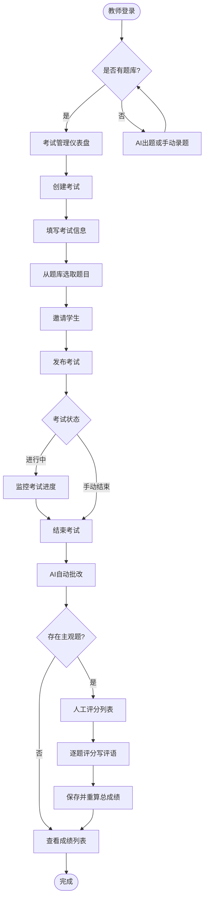
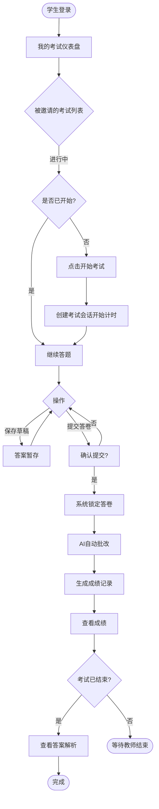
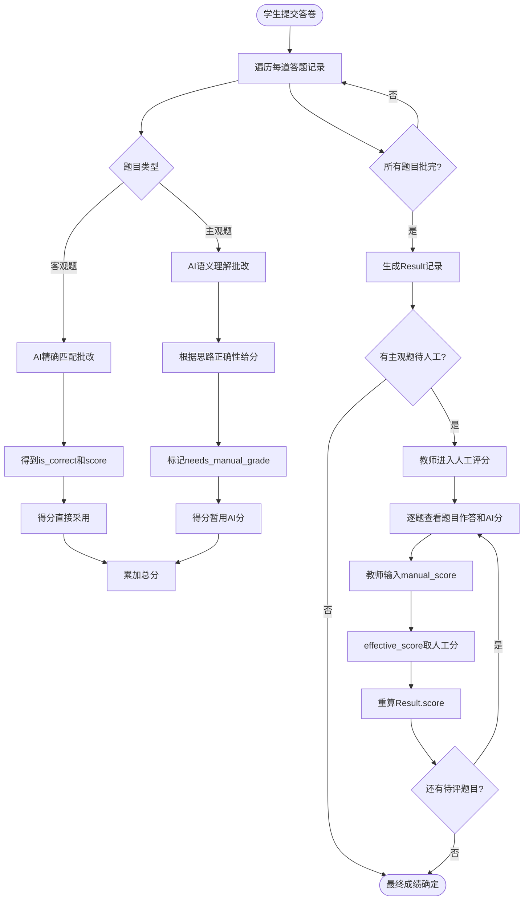
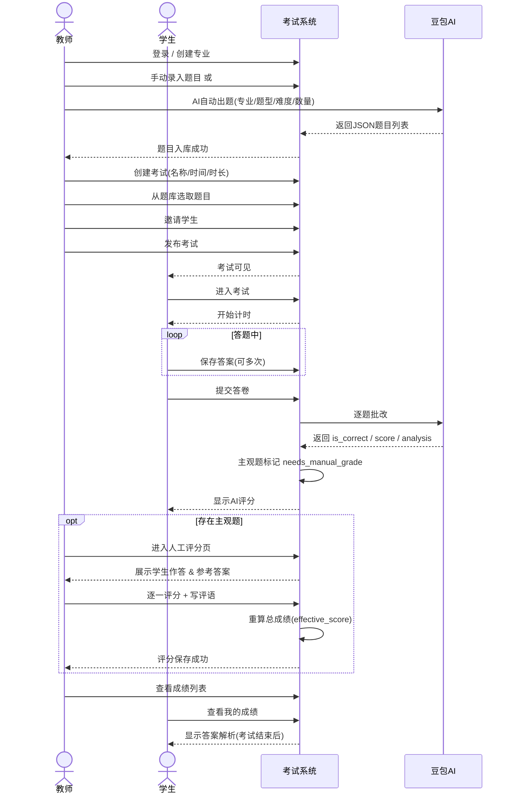
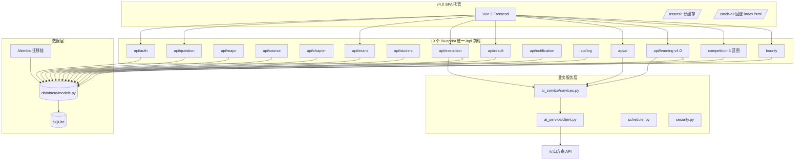

# 智汇学场 — 一体化智能学习平台 开发文档

> 版本: v4.0 | 最后更新: 2026-09-14

## 项目概述

基于 **Flask + Vue 3 + Socket.IO** 的前后端分离一体化智能学习平台，整合 **在线考试、答题竞赛、征集悬赏、自主学习** 四大模块，集成火山引擎豆包大模型 API，提供 AI 智能出题、AI 自动批改、AI 智能答疑等核心 AI 能力。支持教师/学生双角色， subjective 题 AI 语义评分 + 教师人工复核。

v1.x–v3.x 演进历史（考试 → 竞赛 → 悬赏 → 安全加固 → 漏洞审计）见 `更新日志.md`。**v4.0（本次更新）** 是架构里程碑版本，完成以下变革：

- **架构切换至 Vue3 SPA**：剔除 Jinja2 模板、static/ 资源目录、Flask-Login（UserMixin 保留仅兼容 models）、9 个传统蓝图（auth/question_bank/exam/exam_execution/result/ai_service 等）。Flask 新增 SPA 托管层（`template_folder=None`, `static_folder=None`, `/assets/*` 长缓存 + 浏览器路由 catch-all 回退 `frontend/dist/index.html`），单端口部署前后端。
- **四个功能模块**：
  - **在线考试**（原核心）：题库管理（含公共题库跨教师共享）、AI 智能组卷、邀请码加入、防作弊切屏检测、自动/人工批改、成绩分析。
  - **答题竞赛**：1v1 实时 PK、限时积分赛、段位/赛季/勋章/战队竞技化体系。
  - **征集悬赏**：师生均可发布/投稿，采纳自动入库/回填解析，竞技积分激励。
  - **自主学习**（v4.0 新增）：智能错题本（考试/练习自动收录）、自由刷题会话、学习计划追踪、每日学习报告、AI 智能答疑。
- **公共题库**：Question 新增 `creator_id`（FK→User）+ `is_public` 布尔字段；教师可切公开、跨教师查看/复用，仅创建者可编辑删除。
- **SPA 品牌重塑**：系统名「智汇学场」，首页 Home.vue（玻璃拟态 + Canvas 幻灯片 5 张、每张带阴影/径向渐变/高光）、Portal.vue（4 模块入口卡）、登录/注册页全部同步。

v4.0 安全/API 增量：题库写接口创建者校验、考试级联删除（Exam→题目/学生/会话/成绩、Session→Answer）、考试移除学生/智能组卷 API 对齐、通知单条删除前端接入、ExamTake.vue 切屏检测前端接入、CompetitionManage.vue 题目级删除前端接入。

### 核心特性

- 🎯 **前后端分离 + SPA 托管**: Vue 3 SPA + RESTful API；Flask 直接托管 `frontend/dist`（`template_folder=None` / `static_folder=None`，`/assets/*` 长缓存 + 浏览器路由 catch-all 回退 `index.html`），单端口部署
- 🤖 **AI 集成**: 火山方舟 API (出题/批改/解析/答疑),支持 8 种题型
- 🏛 **公共题库** (v4.0): Question 新增 `creator_id` + `is_public`；跨教师共享、仅创建者可编辑删除；支持 `scope=all/mine/public` 筛选
- 📝 **智能组卷**: `POST /api/exams/<id>/smart_composition` 按 major/type/difficulty/source_filter 抽题，调用后自动 invalidate_exam_cache
- 🔒 **防作弊**: 切屏检测上报（3次服务端强制交卷 + 前端 `visibilitychange`/`blur` 监听）、超时自动交卷、考试自动结束
- 📊 **完整考试生命周期**: 草稿 → 发布 → 进行中 → 已结束；邀请码 `.upper().strip()` 幂等加入
- 📝 **人工评分**: 主观题 AI 初评 + 教师复核,自动重算总成绩
- 📦 **批量导入导出**: 支持 Excel/CSV 格式题库导入导出
- **双重认证**: JWT Token (API 端，统一 `verify_token()` 工具函数)；已移除 Flask-Login（UserMixin 保留仅兼容 models）
- ⚡ **实时通信**: Socket.IO 推送竞赛榜单、PK 对战、个人段位/积分/勋章变化、学习通知
- 🏆 **竞技体系**: 6 档段位 (青铜→王者)、自然月赛季惰性归档、8+ 种勋章、固定战队
- 🧠 **学情画像**: 考试+竞赛+自学数据聚合,五维雷达图 (准确率/速度/竞技力/稳定度/活跃度)
- 🪙 **征集悬赏**: 师生均可发布题目征集/答案征集悬赏，投稿-审核-采纳闭环；题目采纳自动入题库、答案采纳回填解析，采纳发放竞技积分与"悬赏新星"勋章
- 📖 **自主学习** (v4.0): 智能错题本（考试/练习自动收录 WrongAnswerRecord，幂等累加 wrong_count）、自由刷题 PracticeSession（预存 PracticeAnswer 供刷新恢复）、学习计划 StudyPlan（暂停/恢复/进度追踪）、每日学习报告 StudyLog（概览 + 聚合）、AI 智能答疑
- 🌐 **时区统一**: 全系统 UTC 存储 + Asia/Shanghai 展示，UTCDateTime 自定义列类型
- ⏰ **后台调度线程**: 过期考试结束/竞赛结算/赛季归档由后台 daemon 线程周期执行，不阻塞请求
- 🛡 **安全加固**: API/页面错误响应分离、CSRF 智能豁免（Bearer 请求自动跳过）、AI 评分 clamp；v3.4 专项：全接口 JWT 鉴权（题库/专业/课程写接口教师专属、通知改 JWT 身份防 IDOR）、学生题库答案/解析脱敏、日志上报鉴权+内容净化、人工评分/答题/交卷归属与状态校验、邀请码按角色隔离、异常详情不下发、上传 50MB 限制 + `nosniff` 安全头；v3.5 专项：全项目 162 端点 IDOR/鉴权复审——考试题目接口（含答案）仅创建教师可访问且鉴权先于缓存、悬赏详情题库题 answer/analysis 仅教师可见+自带快照 answer 仅发布者可见、成绩详情答案/解析考试结束后才对学生公布（`answers_released` 标志）
- 🚀 **生产部署就绪 (v3.3)**: 调试模式/监听地址/CORS 全部环境变量化；生产默认 waitress WSGI 服务器（不开 Werkzeug 调试器）；SECRET_KEY 缺失或为开发默认值时**启动即拒绝**（fail-fast）；CORS 生产默认不开放跨域源
- ⚙️ **性能与健壮性 (v3.3)**: 过期考试收卷按考试独立事务（单考失败不影响整批、缩短 SQLite 写锁持有）+ 批量预载消除 N+1；AI 请求代理改为请求级参数（无全局环境变量副作用）；启动数据修正改 SQL 端过滤（稳态 0 行扫描）
- 📝 **日志健壮性**: SafeRotatingFileHandler 轮转失败安全降级（Windows 占用不崩）、高频请求访问日志静默、Alembic fileConfig 不摧毁应用日志配置

---

## 技术架构

### 后端技术栈

| 分类 | 技术 | 说明 |
|---|---|---|
| Web 框架 | Flask 3.1.x | 轻量级 Python Web 框架 |
| 数据库 | SQLite 3 | 开发环境,`instance/exam_system.db` (instance 目录) |
| ORM | Flask-SQLAlchemy 3.1.x | SQLAlchemy 2.0 语法 (`db.session.get()`) |
| 数据库迁移 | Flask-Migrate 4.1.x | Alembic 迁移链 (0001 基线 / 0002 时区归一 / 0003 结构补全) |
| 时区处理 | UTCDateTime (自定义 TypeDecorator) | 全系统 UTC 存储 + Asia/Shanghai 展示 |
| 实时通信 | Flask-SocketIO 5.6.x | 竞赛榜单/PK 对战/个人段位推送 (async_mode=threading,无需 Redis) |
| Socket 协议 | python-socketio 5.16.x + simple-websocket | 客户端传输层 |
| 生产 WSGI 服务器 | waitress 3.0.x (v3.3) | 生产模式（`FLASK_DEBUG=false`）托管，纯 Python 跨平台；开发模式仍用 Werkzeug |
| 模板引擎 | — | 已全面接入 Vue3 SPA，不再使用服务端模板渲染 |
| 用户认证 | Flask-Bcrypt + PyJWT | 密码哈希 + JWT Token 认证 (统一 `verify_token()` 工具函数)。Flask-Login 已移除（UserMixin 保留仅兼容 models） |
| AI 服务 | 火山引擎方舟 API | 豆包大模型 (出题/批改/解析/答疑) |
| CORS | Flask-CORS | 跨域支持 (Vue 前端) |
| 配置管理 | python-dotenv | `.env` 环境变量 |
| Excel 处理 | openpyxl | 题库 Excel 导入导出 |
| 缓存层 | Redis (可选) | 高性能缓存,提升 API 响应速度 |
| 安全层 | Flask-Limiter + Flask-WTF | Rate Limiting + CSRF 智能防护 |
| 后台调度 | threading daemon | 过期考试结束/竞赛结算/赛季归档 (60s 周期) |
| 静态资源 | Vue3 SPA 构建产物 | `template_folder=None`, `static_folder=None`；Flask 托管 `frontend/dist`（`/assets/*` 长缓存 + 浏览器路由 catch-all 回退 index.html） |

### 前端技术栈

| 分类 | 技术 | 说明 |
|---|---|---|
| 框架 | Vue 3 + Vite | 组合式 API,现代构建工具 |
| UI 组件 | Element Plus | 响应式组件库 |
| 状态管理 | Pinia | 轻量级状态管理 |
| 路由 | Vue Router | 前端路由 |
| HTTP 客户端 | Axios | RESTful API 调用 |
| 实时通信 | socket.io-client | Socket.IO 客户端 (榜单/PK/段位推送) |
| 图表 | vue-chartjs + chart.js | 学情画像五维雷达图 |
| 数学公式 | KaTeX | LaTeX 公式渲染 (npm 集成) |
| CSS | Tailwind CSS | 原子化 CSS 框架 |

### 安全层设计

#### 架构示意图

```
┌─────────────────────────────────────────────────────────────────────────┐
│                           前端请求层                                    │
│   Vue 3 SPA ──► HTTP 请求                                        │
│                      │                                                 │
│                      ▼                                                 │
│              ┌──────────────┐                                          │
│              │ CSRF Token   │  请求头: X-CSRF-TOKEN                     │
│              │ 获取与携带    │                                          │
│              └──────┬───────┘                                          │
└─────────────────────┼───────────────────────────────────────────────────┘
                      ▼
┌─────────────────────────────────────────────────────────────────────────┐
│                           Rate Limiting 层                             │
│  ┌─────────────────────────────────────────────────────────────────┐   │
│  │  请求来源识别 (IP/User ID)                                       │   │
│  │         │                                                       │   │
│  │         ▼                                                       │   │
│  │  ┌─────────────┐    ┌─────────────┐    ┌─────────────┐        │   │
│  │  │ 登录/注册    │    │ AI出题      │    │ 考试提交    │        │   │
│  │  │ 5次/分钟     │    │ 3次/分钟     │    │ 1次/30秒    │        │   │
│  │  └──────┬──────┘    └──────┬──────┘    └──────┬──────┘        │   │
│  │         │                 │                 │                 │   │
│  │         ▼                 ▼                 ▼                 │   │
│  │  ┌─────────────┐    ┌─────────────┐    ┌─────────────┐        │   │
│  │  │ 题目查询    │    │ 成绩查询    │    │ 数据写入    │        │   │
│  │  │ 60次/分钟   │    │ 30次/分钟   │    │ 20次/分钟   │        │   │
│  │  └─────────────┘    └─────────────┘    └─────────────┘        │   │
│  │                          │                                     │   │
│  │                          ▼                                     │   │
│  │              ┌─────────────────────┐                           │   │
│  │              │  超限处理           │  返回 429 Too Many Requests│   │
│  │              │  Retry-After 头     │  X-RateLimit-* 头         │   │
│  │              └─────────────────────┘                           │   │
│  └─────────────────────────────┬─────────────────────────────────┘   │
│                                │                                     │
│                                ▼                                     │
└────────────────────────────────┼──────────────────────────────────────┘
                                 ▼
┌─────────────────────────────────────────────────────────────────────────┐
│                           CSRF 防护层                                  │
│  ┌─────────────────────────────────────────────────────────────────┐   │
│  │  1. Cookie 设置 CSRF Token（HttpOnly, SameSite=Strict）         │   │
│  │  2. 请求头携带 X-CSRF-TOKEN                                     │   │
│  │  3. 服务器验证 Token 一致性                                      │   │
│  │         │                                                       │   │
│  │    ┌────┴────┐                                                  │   │
│  │    ▼         ▼                                                  │   │
│  │  一致     不一致                                                 │   │
│  │    │         │                                                  │   │
│  │    ▼         ▼                                                  │   │
│  │  放行    返回 403                                                │   │
│  └─────────────────────────────────────────────────────────────────┘   │
└─────────────────────────────────────┬───────────────────────────────────┘
                                     │
                                     ▼
                           API 路由处理
                           (正常业务逻辑)
```

#### 安全层技术详解

##### 1. 速率限制模块 (`utils/security.py`)

| 组件 | 说明 | 关键配置 |
|---|---|---|
| **Limiter 实例** | Flask-Limiter 核心对象，管理所有限流规则 | `storage_uri`, `default_limits`, `headers_enabled` |
| **限流策略** | 按接口类型分组的限流规则 | `RateLimitConfig` 类 |
| **来源识别** | 默认使用客户端 IP，支持自定义 key 函数 | `get_remote_address` |
| **响应头** | 返回限流状态信息 | `X-RateLimit-Limit`, `X-RateLimit-Remaining`, `Retry-After` |

##### 2. 限流策略配置

| 策略名称 | 规则 | 适用接口 | 说明 |
|---|---|---|---|
| `AUTH` | 5次/分钟 | 登录、注册 | 防暴力破解 |
| `AI_GENERATE` | 3次/分钟 | AI出题 | 控制 API 费用 |
| `QUESTION_QUERY` | 60次/分钟 | 题目列表查询 | 常规查询 |
| `EXAM_SUBMIT` | 1次/30秒 | 考试提交 | 防止重复提交 |
| `RESULT_QUERY` | 30次/分钟 | 成绩分析查询 | 计算密集型 |
| `DATA_WRITE` | 20次/分钟 | 创建考试等写入操作 | 防滥用 |
| `DEFAULT` | 60次/分钟 | 其他未配置接口 | 兜底策略 |

##### 3. CSRF 防护机制

**Vue3 前端工作流程**：
```
1. 应用启动时调用 /api/csrf-token 获取 Token
2. 服务器生成 Token 并存入 Cookie（HttpOnly, SameSite=Strict）
3. 返回 Token 给前端，前端存入内存
4. 每次 axios 请求自动携带 X-CSRF-TOKEN 请求头
5. 服务器验证请求头 Token 与 Cookie 中 Token 是否一致
6. 一致则放行，不一致返回 403
```

**防护原理**：
- 恶意网站无法读取用户浏览器中的 CSRF Token Cookie（HttpOnly）
- 恶意网站无法在跨域请求中携带自定义请求头（浏览器同源策略）
- 恶意网站无法构造包含有效 Token 的表单提交
- 因此恶意网站无法构造有效的 CSRF 请求

**豁免规则**（`utils/security.py::_smart_csrf_check`）：
- **Bearer token (JWT) 请求自动豁免**：Vue 前端 API 请求携带 `Authorization: Bearer` 头，不依赖 Cookie 会话，天然不受 CSRF 威胁
- **认证前公开接口豁免**：`/api/login`、`/api/register`、`/api/csrf-token`（无会话可保护）
- **日志上报接口豁免**：`/api/logs`、`/api/logs/vue`——两接口视图内自行 `verify_token()` 校验（v3.4 起未登录 401），豁免 CSRF 是为了让 401 能正确返回而非被 CSRF 拦截
- 其余 Cookie 请求一律强制校验

**前端覆盖范围**：
| 前端类型 | 文件数量 | CSRF 防护方式 |
|---|---|---|
| Vue3 (axios) | 全部 | X-CSRF-TOKEN 请求头 |

##### 4. 前端集成 (`frontend/src/utils/request.js`)

| 功能 | 实现方式 |
|---|---|
| **Token 获取** | 应用启动时自动调用 `/api/csrf-token` |
| **Token 携带** | 请求拦截器自动添加 `X-CSRF-TOKEN` 头 |
| **Token 刷新** | 403 响应时自动重新获取 Token |
| **限流提示** | 429 响应时显示"请求过于频繁"提示 |
| **认证失效** | 401 响应时清除本地存储并跳转首页 |

##### 5. 安全配置

**环境变量配置**（`.env` 文件，v3.3 起部署相关配置全部环境变量化）：

```bash
# ── 运行模式（v3.3）──
FLASK_DEBUG=true               # 开发 true；生产必须 false 或不设（默认 false）
FLASK_HOST=127.0.0.1           # 监听地址；局域网/外网访问设 0.0.0.0
FLASK_PORT=5000

# ── 密钥 ──
# 生产必填强随机值：python -c "import secrets;print(secrets.token_hex(32))"
# 生产模式下缺失或仍为开发默认值 dev-secret-key-change-in-production 时，应用启动即 RuntimeError 拒绝运行
SECRET_KEY=...
WTF_CSRF_SECRET_KEY=your-csrf-secret-key   # 缺省回落 SECRET_KEY
WTF_CSRF_TIME_LIMIT=3600

# ── 跨域白名单（HTTP API 与 Socket.IO 共用，v3.3）──
# 逗号分隔；显式配置优先。不配置时：开发模式预置 localhost:5173-5176/5000 等本地源，
# 生产模式默认为空（不开放任何跨域源，同源访问不受影响）
CORS_ORIGINS=https://your-frontend.example.com

# ── 速率限制 ──
RATE_LIMIT_STORAGE_URI=memory://
RATE_LIMIT_DEFAULT=60 per minute
RATE_LIMIT_HEADERS_ENABLED=True
```

**生产环境建议**：

| 配置项 | 开发环境 | 生产环境 |
|---|---|---|
| `FLASK_DEBUG` | `true` | **必须 false**（否则启用 Werkzeug 调试器，存在远程代码执行风险） |
| `SECRET_KEY` | 缺省回落开发默认值 | **必填强随机值**（缺失/默认值启动即报错） |
| `CORS_ORIGINS` | 不配置（预置 localhost 源） | **显式设为前端域名**（默认空，不配置则跨域请求被拒） |
| `FLASK_HOST` | `127.0.0.1` | 需外网访问时 `0.0.0.0` |
| WSGI 服务器 | Werkzeug（`socketio.run`，含 WebSocket） | **waitress**（自动启用，16 线程；Socket.IO 自动降级 HTTP 长轮询） |
| `RATE_LIMIT_STORAGE_URI` | `memory://` | `redis://localhost:6379/1` |
| `CSRF_ENABLED` | `True` | `True` |

> **生产启动行为**：`FLASK_DEBUG=false` 时 `app.py` 不再使用 Werkzeug，改由 `waitress.serve(app, threads=16, channel_timeout=120)` 提供服务；未安装 waitress 会给出 `pip install waitress` 明确提示。waitress 不支持 WebSocket 升级，Socket.IO 客户端自动回退 HTTP 长轮询（前端本有轮询兜底）；如需原生 WebSocket，可在 Linux 上用 gunicorn + eventlet/gevent worker。

##### 6. 安全提升效果

| 安全威胁 | 无防护 | 有防护 |
|---|---|---|
| **暴力破解登录** | 可无限次尝试密码 | 5次/分钟限制，触发封禁 |
| **AI API 滥用** | 费用无限消耗 | 3次/分钟限制，控制成本 |
| **考试作弊** | 可重复提交 | 1次/30秒限制 |
| **CSRF 攻击** | 可冒充用户操作 | Token 验证，攻击失败 |
| **API 资源耗尽** | 可恶意刷接口 | 自动限流，保障服务 |

### 缓存层设计

#### 架构示意图

```
┌─────────────────────────────────────────────────────────────────────────┐
│                           前端请求层                                    │
│   Vue 3 SPA ──► HTTP 请求 ──► Flask API                            │
└─────────────────────────────────────────────────────────────────────────┘
                                    │
                                    ▼
┌─────────────────────────────────────────────────────────────────────────┐
│                           API 路由层                                   │
│   api/question_routes.py                                               │
│   api/major_routes.py                                                  │
│   api/course_routes.py                                                 │
│   api/chapter_routes.py                                                │
│   api/exam_routes.py                                                   │
│   api/result_routes.py                                                 │
└─────────────────────────────────────────────────────────────────────────┘
                                    │
                                    ▼
┌─────────────────────────────────────────────────────────────────────────┐
│                           Redis 缓存层                                  │
│  ┌─────────────────────────────────────────────────────────────────┐   │
│  │                    缓存命中判断                                    │   │
│  │  ┌─────────────┐    ┌─────────────┐    ┌─────────────┐        │   │
│  │  │  题库缓存    │    │  专业/课程   │    │  考试缓存    │        │   │
│  │  │ questions:* │    │ majors:*    │    │ exams:*     │        │   │
│  │  │  5min TTL   │    │ 5-10min TTL │    │ 1-2min TTL  │        │   │
│  │  └──────┬──────┘    └──────┬──────┘    └──────┬──────┘        │   │
│  │         │                 │                 │                 │   │
│  │         ▼                 ▼                 ▼                 │   │
│  │  ┌─────────────┐    ┌─────────────┐    ┌─────────────┐        │   │
│  │  │  章节缓存    │    │  成绩分析    │    │  通知缓存    │        │   │
│  │  │ chapters:*  │    │ analysis:*  │    │ notif:*     │        │   │
│  │  │  5min TTL   │    │  10min TTL  │    │  5min TTL   │        │   │
│  │  └─────────────┘    └─────────────┘    └─────────────┘        │   │
│  └─────────────────────────────┬─────────────────────────────────┘   │
│                                │ 缓存未命中                           │
│                                ▼                                     │
│                    ┌─────────────────────┐                           │
│                    │   SQLite 数据库     │                           │
│                    │   exam_system.db    │                           │
│                    └─────────────────────┘                           │
└─────────────────────────────────────────────────────────────────────────┘
                                    │
                                    ▼
                           数据写入/更新
                                    │
                                    ▼
                    ┌─────────────────────┐
                    │   缓存失效机制       │
                    │   invalidate_*()    │
                    │   删除相关缓存键     │
                    └─────────────────────┘
```

#### 缓存层技术详解

##### 1. 缓存工具模块 (`utils/redis_cache.py`)

| 组件 | 说明 | 关键函数 |
|---|---|---|
| **连接管理** | Redis 单例客户端，支持环境变量配置 | `init_redis()`, `is_redis_available()` |
| **基础操作** | 统一的缓存读写接口，JSON 序列化 | `get_cache()`, `set_cache()`, `delete_cache()` |
| **模式匹配删除** | 支持通配符批量删除相关缓存 | `delete_pattern()` |
| **装饰器** | 通用缓存装饰器，自动处理缓存逻辑 | `@cached(expires=300)` |
| **缓存键定义** | 集中式缓存键常量，避免硬编码 | `CacheKey` 类 |
| **失效策略** | 按业务模块分组的失效函数 | `invalidate_question_cache()` 等 |

##### 2. 缓存键设计规范

采用层级命名结构，格式为 `模块:资源:条件`：

| 模块 | 缓存键模式 | 示例 | 过期时间 |
|---|---|---|---|
| 题库 | `questions:major={id}:course={id}:type={type}` | `questions:major=1:type=single_choice` | 5分钟 |
| 专业 | `majors` / `major:{id}` | `major:1` | 10分钟 / 5分钟 |
| 课程 | `courses:major={id}` | `courses:major=1` | 5分钟 |
| 章节 | `chapters:course={id}` | `chapters:course=1` | 5分钟 |
| 考试 | `exams:user={id}` / `exam:{id}` | `exams:user=1` | 2分钟 |
| 考试题目 | `exam:questions:{id}` | `exam:questions:1` | 1分钟 |
| 成绩分析 | `result:analysis:{id}` | `result:analysis:1` | 10分钟 |

##### 3. 缓存策略

**读取策略 - Cache-Aside 模式**：
```
1. 请求到达 API
2. 构建缓存键
3. 尝试从 Redis 获取缓存
4. ✓ 命中 → 直接返回缓存数据
5. ✗ 未命中 → 查询数据库 → 写入缓存 → 返回数据
```

**写入策略 - Write-Through 模式**：
```
1. 数据写入/更新/删除
2. 提交数据库事务
3. 调用对应模块的 invalidate_*() 函数
4. 删除相关缓存键（下次读取将重新缓存）
```

##### 4. 失效策略详解

| 操作 | 失效范围 | 原因 |
|---|---|---|
| 新增题目 | 该专业/课程下所有题目缓存 | 题目列表发生变化 |
| 更新题目 | 旧专业/课程 + 新专业/课程缓存 | 题目所属分类可能变更 |
| 删除题目 | 该专业/课程下所有题目缓存 | 题目列表发生变化 |
| 批量导入题目 | 所有题目缓存 | 大规模数据变更 |
| 新增/更新专业 | 专业列表 + 该专业下课程缓存 | 专业数据及关联课程变化 |
| 删除专业 | 专业缓存 + 关联课程 + 关联题目缓存 | 级联删除影响所有关联数据 |
| 新增/更新课程 | 课程列表 + 关联章节缓存 | 课程数据及关联章节变化 |
| 删除课程 | 课程缓存 + 关联章节 + 关联题目缓存 | 级联删除影响所有关联数据 |
| 新增/更新章节 | 该课程下章节缓存 | 章节列表发生变化 |
| 删除章节 | 该课程下章节缓存 | 章节列表发生变化 |
| 创建/更新/发布/结束/删除考试 | 考试列表 + 考试详情 + 考试题目缓存 | 考试状态或内容变化 |
| 添加/移除考试题目 | 考试详情 + 考试题目缓存 | 考试题目列表变化 |
| 人工评分 | 成绩分析缓存 | 评分影响统计分析结果 |

##### 5. 容错机制

| 场景 | 处理方式 | 影响 |
|---|---|---|
| Redis 服务未启动 | `init_redis()` 返回 False，自动降级 | 系统正常运行，直接查询数据库 |
| Redis 连接超时 | 捕获异常，记录日志，返回 None | 当前请求降级，后续请求继续尝试 |
| Redis 写入失败 | 捕获异常，记录日志，不抛异常 | 缓存未写入，下次请求重新查询 |
| Redis 读取失败 | 捕获异常，记录日志，返回 None | 当前请求降级，查询数据库 |
| Redis 内存不足 | Redis 自动淘汰策略（LRU） | 旧缓存被清除，自动重建 |

##### 6. 性能预期

| 指标 | 优化前 | 优化后（缓存命中） | 提升幅度 |
|---|---|---|---|
| 题目列表查询 | 50-200ms | < 10ms | 5-20x |
| 专业/课程/章节查询 | 30-80ms | < 10ms | 3-8x |
| 考试列表查询 | 50-150ms | < 10ms | 5-15x |
| 成绩分析查询 | 100-500ms | < 10ms | 10-50x |
| 数据库 QPS | 高（每次请求都查询） | 低（仅缓存未命中时查询） | 大幅降低 |

### 时区统一设计 (v3.1)

#### 全系统时间约定

| 层 | 时间类型 | 说明 |
|---|---|---|
| Python 代码层 | aware UTC | `utcnow()` 返回 `datetime.now(timezone.utc)` |
| 数据库存储 | naive UTC | `UTCDateTime` TypeDecorator 写入时 aware→naive UTC |
| 数据库读取 | aware UTC | `UTCDateTime` 读取时 naive→aware UTC |
| 展示/输入 | Asia/Shanghai (UTC+8) | `iso_local()` / `parse_dt()` 自动转换 |

#### 核心工具 (`utils/timeutil.py`)

| 函数 | 说明 |
|---|---|
| `utcnow()` | 当前时间：aware UTC（全系统唯一的「现在」来源） |
| `aware_min()` | 排序兜底用的 aware datetime.min |
| `localtime(dt)` | aware/naive(按 UTC 解释) → Asia/Shanghai 墙上时间 |
| `iso_local(dt)` | 存储值 → 本地时间 ISO 字符串（前端 `new Date()` 按本地解析） |
| `fmt_local(dt, fmt)` | 存储值 → 本地时间格式化字符串（API 序列化 / 前端展示） |
| `parse_dt(value)` | 用户输入 → aware UTC（带时区按其时区转 UTC，不带时区按本地解释） |
| `current_season()` | 当前赛季键（按本地日历月 'YYYY-MM'） |
| `season_of(dt)` | 存储值 → 所属赛季键 |

### 后台调度线程 (v3.1)

#### 架构

将过期考试结束、竞赛结算、赛季归档从 `before_request` 钩子移至独立 daemon 线程，60 秒周期执行。

| 组件 | 说明 |
|---|---|
| `utils/scheduler.py` | 后台 daemon 线程（name=`bg-scheduler`），60s 周期 |
| `start_scheduler(app, interval)` | 启动线程（幂等：重复调用不重复启动） |
| `stop_scheduler()` | 停止线程（优雅退出） |

#### 调度任务

| 任务 | 来源 | 说明 |
|---|---|---|
| `auto_end_expired_exams()` | `app.py` | 过期考试自动结束 + 客观题本地批改 |
| `settle_pending_competitions()` | `competition/gamification.py` | 竞赛惰性结算 |
| `ensure_seasons()` | `competition/season.py` | 赛季惰性归档 (CAS 抢锁) |

> 三个任务独立 try/except，单点失败不阻塞其余任务，异常时主动 `db.session.rollback()` 防止会话污染。

> **v3.3 事务粒度优化**：`auto_end_expired_exams()` 由"所有过期考试共用一个大事务"改为**每个考试独立事务**（独立 try/commit/rollback）：
> - 单个考试批改失败只回滚该考试，不影响其余考试，下一轮自动重试；
> - 缩短 SQLite 库级写锁持有时间，避免批量批改期间阻塞学生交卷写入；
> - 开考时一次性批量预载本场考试的题目分值（`ExamQuestion`）与题目实体（`Question`）为字典，消除逐答案的 N+1 查询；
> - `IntegrityError`（并发交卷导致成绩唯一约束冲突）时整场回滚并记 warning，下轮重试。

### 错误处理与 CSRF 智能豁免 (v3.1)

#### 错误响应区分 API/页面

| 请求类型 | 响应格式 | 判断条件 |
|---|---|---|
| API 请求 | JSON `{"message": "..."}` | `request.path` 以 `/api/` 开头，或 Accept 头含 JSON |
| 浏览器页面 | SPA 静态 HTML 错误页 (占位符替换) | 其余请求；v4.0 移除 render_template_string，改用 `_static_error_page()` 从模板 HTML 读入后替换 `__CODE__`/`__MESSAGE__` |

#### CSRF 智能豁免

`security._smart_csrf_check` 对 Bearer token (JWT) 请求自动跳过 CSRF 校验；v4.0 移除 Session 认证（Flask-Login），仅 JWT 单轨。

### 项目结构详解

```
exam_system_Beta/
├── .env                          # 环境变量 (密钥/API/配置)
├── .gitignore                    # Git 忽略文件配置
├── config.py                     # Flask 配置类 (数据库/AI/引擎选项/CSRF/限流)
├── app.py                        # 应用入口 + 蓝图注册 + 错误处理器 + init_database
├── start-all.bat                 # Windows 一键启动脚本
├── 更新日志.md                    # 项目更新记录
├── 后续方向.md                    # 项目后续发展方向
├── 说明文档.md                    # 项目技术文档 (本文件)
│
├── database/                     # 数据层
│   ├── __init__.py               # SQLAlchemy + Bcrypt 实例 (延迟初始化，避免循环 import)
│   ├── models.py                 # ORM 模型 + 枚举定义 + 关联关系
│   ├── types.py                  # 自定义列类型 (UTCDateTime / JSONType)
│   └── init_data.py              # 初始数据
│
├── migrations/                   # Flask-Migrate / Alembic 迁移链
│   ├── alembic.ini               # Alembic 配置
│   ├── env.py                    # 迁移环境
│   └── versions/                 # 迁移版本
│       ├── 0001_baseline.py      # 基线迁移 (全表)
│       ├── 0002_tz_normalize.py  # 时区归一 (历史数据本地→UTC)
│       └── 0003_schema_refactor.py # 结构补全 (唯一约束 + 新字段)
│
├── ai_service/                   # AI 服务模块 (v4.0 简化，仅 2 文件)
│   ├── client.py                 # 火山方舟 HTTP 客户端 (重试/清洗/日志/答疑)
│   └── services.py               # AI 业务逻辑 (出题/批改/解析/答疑，评分 clamp [0,100])
│
├── api/                          # RESTful API 模块 (供 Vue 前端调用，统一 `/api` 前缀)
│   ├── __init__.py               # 包初始化
│   ├── auth_routes.py            # 认证 API (登录/注册/获取当前用户)
│   ├── question_routes.py        # 题目 API (CRUD + scope=all/mine/public 筛选 + toggle_public + creator_id 校验 + _normalize_options)
│   ├── course_routes.py          # 课程 API (CRUD)
│   ├── major_routes.py           # 专业 API (CRUD)
│   ├── chapter_routes.py         # 章节 API (CRUD)
│   ├── exam_routes.py            # 考试 API (CRUD/发布/结束/题目管理/邀请码/QR码/智能组卷 smart_composition)
│   ├── student_routes.py         # 学生管理 API (邀请/列表/移除 remove_student)
│   ├── execution_routes.py       # 考试执行 API (开始/答题/提交/切屏 report_switch + sync_wrong_from_exam 错题收录钩子)
│   ├── result_routes.py          # 成绩 API (查询/人工评分/分析)
│   ├── notification_routes.py    # 通知 API (列表/已读/单条删除 DELETE /api/notifications/:id)
│   ├── log_routes.py             # 前端日志接收 API
│   ├── ai_routes.py              # AI 服务 API (出题/题型枚举，count 参数容错)
│   └── learning_routes.py        # 自学 API (17 端点：错题本/刷题/学习计划/学习报告/AI 答疑，v4.0 新增)
│
├── competition/                  # 竞赛 & 竞技化模块 (v2.9+)
│   ├── __init__.py
│   ├── models.py                 # 竞赛/PK/段位/赛季/勋章/战队 12 张表
│   ├── routes.py                 # 竞赛管理 API (CRUD/发布/题目/报名)
│   ├── play_routes.py            # 限时赛参赛 (加入/开始/答题/交卷 + lobby N+1 优化)
│   ├── pk_routes.py              # 1v1 PK (发起/接受/大厅/答题/结算 + WAITING 过期清理)
│   ├── gamification.py           # 段位/积分/勋章结算服务层
│   ├── season.py                 # 赛季惰性归档 (CAS 抢锁)
│   ├── gamification_routes.py    # 段位/赛季/勋章/学情画像 API
│   ├── team_routes.py            # 战队 API (创建/加入/退出/转让/解散)
│   ├── scoring.py                # 竞赛计分 (base+speed，time_spent 服务端计算)
│   ├── leaderboard.py            # 榜单聚合 (joinedload user + get_my_rank 复用行)
│   ├── realtime.py               # Socket.IO 推送封装 (竞赛房/PK房/个人房)
│   └── socket_events.py          # Socket.IO 房间事件注册 (JWT 鉴权)
│
├── bounty/                       # 征集悬赏模块 (v3.2，独立包，与考试/竞赛并列)
│   ├── __init__.py
│   ├── models.py                 # Bounty(悬赏单)/BountySubmission(投稿) + 3 个枚举
│   ├── routes.py                 # 悬赏 API (发布/投稿/审核采纳/拒绝，9 个路由)
│   └── rewards.py                # 采纳奖励 (竞技积分 + "悬赏新星🪙"勋章 + Socket 推送)
│
├── frontend/                     # Vue 3 前端项目 (v4.0 全面 SPA 化，单端口部署)
│   ├── src/
│   │   ├── views/                # 页面组件 (41 个视图，v4.0 新增 6 个自学)
│   │   │   ├── Home.vue              # 首页 (玻璃拟态 + Canvas 幻灯片 5 张，品牌「智汇学场」)
│   │   │   ├── Login.vue             # 登录页
│   │   │   ├── Register.vue          # 注册页
│   │   │   ├── Portal.vue            # 模块选择入口 (考试/竞赛/悬赏/自学，4 模块卡)
│   │   │   ├── Layout.vue            # 布局组件 (侧边栏 4 模块入口/顶栏/Socket.IO 个人房间监听)
│   │   │   ├── QuestionList.vue      # 题库管理 (scope 切换 all/mine/public + 公开徽章 + 创建者仅可编辑)
│   │   │   ├── MajorList.vue         # 专业列表
│   │   │   ├── MajorDetail.vue       # 专业详情
│   │   │   ├── ChapterList.vue       # 章节列表
│   │   │   ├── AiGenerate.vue        # AI 出题
│   │   │   ├── ExamDashboard.vue     # 考试仪表盘
│   │   │   ├── EditExam.vue          # 编辑考试
│   │   │   ├── StudentDashboard.vue  # 学生仪表盘 (含邀请码加入入口 ?join=CODE 自动填充)
│   │   │   ├── ExamTake.vue          # 在线答题 (切屏检测 visibilitychange/blur 监听 + 3次服务端强制交卷)
│   │   │   ├── ResultList.vue        # 成绩列表
│   │   │   ├── ExamResults.vue       # 考试成绩
│   │   │   ├── ResultDetail.vue      # 成绩详情
│   │   │   ├── ResultAnalysis.vue    # 成绩分析
│   │   │   ├── GradingPage.vue       # 人工评分
│   │   │   ├── UserProfile.vue       # 用户资料
│   │   │   ├── SystemSettings.vue    # 系统设置
│   │   │   ├── CompetitionHome.vue   # 竞赛首页 (教师管理入口)
│   │   │   ├── CompetitionPlaza.vue  # 竞赛广场 (学生浏览)
│   │   │   ├── CompetitionManage.vue  # 竞赛管理 (教师 CRUD + 题目级删除 DELETE /api/competitions/:id/questions/:cq_id)
│   │   │   ├── CompetitionTake.vue   # 限时赛答题
│   │   │   ├── CompetitionLeaderboard.vue # 竞赛榜单 (Socket.IO 实时)
│   │   │   ├── PkLobby.vue           # PK 大厅
│   │   │   ├── PkTake.vue            # PK 答题
│   │   │   ├── RankCenter.vue        # 段位中心 (段位/赛季榜/勋章墙)
│   │   │   ├── TeamCenter.vue        # 战队中心
│   │   │   ├── StudyProfile.vue      # 学情画像 (五维雷达图)
│   │   │   ├── BountyPlaza.vue       # 悬赏广场 (列表/筛选/投稿入口)
│   │   │   ├── BountyPublish.vue     # 发布悬赏 (题目征集/答案征集)
│   │   │   ├── BountyDetail.vue      # 悬赏详情 (投稿/审核采纳/拒绝)
│   │   │   ├── BountyMine.vue        # 我的悬赏 (我发布的/我的投稿)
│   │   │   ├── LearningHome.vue      # 自学首页 (v4.0 新增，青色渐变入口卡 #06b6d4)
│   │   │   ├── WrongNotebook.vue     # 错题本 (v4.0 新增，AI 答疑弹窗)
│   │   │   ├── PracticeList.vue      # 刷题列表 (v4.0 新增)
│   │   │   ├── PracticeDetail.vue    # 刷题详情 (v4.0 新增，刷新恢复 PracticeAnswer 预存)
│   │   │   ├── StudyPlan.vue         # 学习计划 (v4.0 新增，暂停/恢复/进度追踪)
│   │   │   └── StudyReport.vue       # 学习报告 (v4.0 新增，概览 + 每日聚合)
│   │   ├── components/           # 可复用组件
│   │   │   ├── KatexRenderer.vue     # KaTeX 数学公式渲染器
│   │   │   └── VideoModal.vue        # 视频演示弹窗 (Canvas 5 张幻灯片 + 7 辅助绘制函数: setShadow/clearShadow/drawGlassCard/drawGradientBar/drawGradientCircle/drawGlowRing/drawGradientText)
│   │   ├── stores/               # Pinia 状态管理
│   │   │   ├── auth.js               # 认证状态 (登录/登出/用户信息)
│   │   │   └── theme.js              # 主题状态 (亮色/暗色模式)
│   │   ├── router/               # Vue Router 配置
│   │   │   └── index.js              # 路由定义 (含守卫, module 分组)
│   │   ├── utils/                # 工具函数
│   │   │   ├── request.js            # Axios 封装 (拦截器/Token注入)
│   │   │   ├── socket.js             # Socket.IO 客户端单例 (个人房间/鉴权)
│   │   │   └── logger.js             # 前端日志
│   │   ├── App.vue               # 根组件
│   │   ├── main.js               # 入口文件
│   │   └── style.css             # 全局样式
│   ├── .env.development          # 开发环境变量
│   ├── index.html                # HTML 入口
│   ├── package.json              # 前端依赖
│   ├── package-lock.json         # 依赖锁定文件
│   ├── vite.config.js            # Vite 构建配置 (含代理)
│   ├── tailwind.config.js        # Tailwind CSS 配置
│   ├── postcss.config.js         # PostCSS 配置
│   ├── tsconfig.json             # TypeScript 配置
│   ├── start.bat                 # 前端启动脚本 (Windows)
│   └── start.ps1                 # 前端启动脚本 (PowerShell)
│
├── uploads/                      # 上传文件目录 (自动创建)
│
│
├── utils/                        # 工具模块
│   ├── logger.py                 # 日志配置 (SafeRotatingFileHandler 轮转降级/访问日志静默高频路径)
│   ├── redis_cache.py            # Redis 缓存工具 (连接/缓存键/失效策略)
│   ├── security.py               # 安全工具 (Rate Limiting/CSRF防护/verify_token)
│   ├── scheduler.py              # 后台调度线程 (60s 周期：过期考试/竞赛结算/赛季归档)
│   ├── timeutil.py               # 时区统一工具 (utcnow/iso_local/parse_dt/season)
│   └── decorators.py             # 日志装饰器 (错误捕获/性能监控)
│
└── logs/                         # 日志目录 (运行时生成)
    ├── app.log                    # 主应用日志
    ├── error.log                  # 错误日志
    └── access.log                 # 访问日志
```

---

## 数据库模型详解

### 2.1 枚举定义 (`database/models.py` + `competition/models.py`)

| 枚举类 | 值 | 说明 |
|---|---|---|
| **RoleEnum** | `teacher`, `student` | 用户角色 |
| **ExamStatusEnum** | `draft`, `published`, `ended` | 考试状态 |
| **QuestionTypeEnum** | `single_choice`, `multiple_choice`, `fill_blank`, `true_false`, `short_answer`, `programming`, `application`, `calculation` | 题型 (8种) |
| **DifficultyEnum** | `easy`, `medium`, `hard` | 难度 |
| **NotificationTypeEnum** | `success`, `warning`, `info`, `error` | 通知类型 |
| **CompetitionStatusEnum** | `draft`, `published`, `ongoing`, `ended` | 竞赛状态（`published` 到开放窗口自动转 `ongoing`，窗口结束转 `ended`，由 `sync_status()` 惰性同步） |
| **CompetitionTypeEnum** | `timed`, `pk`, `quick_answer` | 竞赛类型（`timed` 限时积分赛已实现；`pk`/`quick_answer` 为预留值，PK 实际以限时赛题库为题源发起） |
| **ParticipantStatusEnum** | `joined`, `playing`, `finished` | 参赛状态 |
| **PkBattleStatusEnum** | `waiting`, `playing`, `finished`, `cancelled` | PK 对战状态 (v3.1 新增 `cancelled`)|
| **BountyTypeEnum** | `question`, `answer` | 悬赏类型：题目征集 / 答案征集 (v3.2) |
| **BountyStatusEnum** | `open`, `closed`, `expired` | 悬赏状态：征集中 / 已采纳关闭 / 已过期 (`expired` 由 `effective_status()` 读取时惰性反映) (v3.2) |
| **SubmissionStatusEnum** | `pending`, `accepted`, `rejected` | 投稿审核状态 (v3.2) |
| **自学模块状态 (无独立 Enum)** | PracticeSession.status: `in_progress`/`completed`<br>StudyPlan.status: `active`/`paused`/`completed`<br>StudyLog.log_type: `exam`/`competition`/`practice`<br>WrongAnswerRecord.source_type: `exam`/`competition`/`practice` | 自学模块 v4.0 新增，使用硬编码字符串常量而非 Enum 类 (便于 DB 直接读写) |

`QuestionTypeEnum` 扩展方法:
- `SUBJECTIVE_TYPES = {'short_answer', 'programming', 'application', 'calculation'}`: 主观题集合
- `is_subjective(type) -> bool`: 判断是否为主观题
- `label(type) -> str`: 返回中文名称 (如 `programming` → `编程题`)

### 2.2 数据表结构

| 表名 | 主键 | 关键字段 | 外键关联 | 说明 |
|---|---|---|---|---|
| **user** | id | username, email, password_hash, role, created_at | - | 用户表 |
| **department** | id | name, description | - | 院系表 |
| **major** | id | name, description, department_id | department.id | 专业表 |
| **course** | id | name, major_id, description, credit, semester | major.id | 课程表 |
| **chapter** | id | name, course_id, description, order_num | course.id | 章节表 |
| **question** | id | content, options(JSON), answer, analysis, knowledge, major_id, course_id, chapter_id, type, difficulty, source, creator_id(FK→user), is_public(bool), created_at | major.id, course.id, chapter.id, user.id (creator, v4.0) | 题库表 (v4.0 新增 creator_id+is_public 公共题库支持；creator_id 允许 NULL 兼容存量历史题目；scope=all/mine/public 筛选；仅创建者可 PUT/DELETE；toggle_public 单端点) |
| **exam** | id | title, description, start_time, end_time, duration, status, creator_id, created_at, invitation_code, invitation_url | user.id (creator) | 考试表 |
| **exam_question** | (exam_id, question_id) | score, order | exam.id, question.id | 考试-题目关联表 |
| **exam_student** | (exam_id, student_id) | invited_at | exam.id, user.id (student) | 考试-学生邀请表 |
| **exam_session** | id | exam_id, student_id, start_time, end_time, status, switch_count | exam.id, user.id (student) | 考试会话表 |
| **answer** | id | session_id, question_id, student_answer, is_correct, score, manual_score, manual_comment, needs_manual_grade | exam_session.id (session), question.id | 答题记录表 |
| **result** | id | exam_id, student_id, score, total_score, submitted_at, ai_analysis | exam.id, user.id (student) | 成绩表 |
| **notification** | id | user_id, title, content, type, read, related_type, related_id, created_at | user.id | 通知表 |
| **competition** | id | title, competition_type, status, start_time, end_time, duration, draw_count, scoring_rule, total_score, allow_pk, points_settled, creator_id, created_at | user.id (creator) | 竞赛表 |
| **competition_question** | id | competition_id, question_id, q_type, q_content, options(JSON), answer, score, order | competition.id, question.id | 竞赛题目快照 |
| **competition_participant** | id | competition_id, user_id, status, assigned_cq_ids(JSON), score, used_time, started_at, finished_at | competition.id, user.id | 限时赛参与者 |
| **competition_answer** | id | participant_id, cq_id, answer, is_correct, gained_score, time_spent, answered_at | competition_participant.id, competition_question.id | 限时赛答题记录（唯一约束 participant_id+cq_id） |
| **pk_battle** | id | competition_id, challenger_id, opponent_id, status, winner_id, challenger_score, opponent_score, challenger_answered, opponent_answered, challenger_finished_at, opponent_finished_at, started_at, finished_at, created_at | competition.id, user.id (challenger/opponent/winner) | PK 对战表 |
| **pk_answer** | id | battle_id, player_id, cq_id, answer, is_correct, gained_score, time_spent, answered_at | pk_battle.id, user.id (player), competition_question.id | PK 答题记录（唯一约束 battle_id+player_id+cq_id） |
| **user_points_profile** | id | user_id, season(YYYY-MM), points, pk_win, pk_lose, pk_draw, streak, max_streak, timed_finished, last_played_at | user.id | 赛季积分档案 |
| **season_meta** | id | season(YYYY-MM), archived, archived_at | - | 赛季元信息 |
| **season_archive** | id | season(YYYY-MM), user_id, rank, points, tier, pk_win, pk_total, timed_finished | user.id | 赛季归档快照 |
| **user_badge** | id | user_id, badge_code, season(YYYY-MM), related_id, granted_at | user.id | 勋章发放记录 |
| **team** | id | name, description, captain_id, created_at | user.id (captain) | 战队表 |
| **team_member** | id | team_id, user_id, role(captain/member), joined_at | team.id, user.id | 战队成员表 |
| **bounty** | id | publisher_id, bounty_type(question/answer), title, description, target_question_id, target_question_snapshot(JSON), major_id, q_type, q_difficulty, reward_points, status(open/closed/expired), deadline, accepted_submission_id, created_at, closed_at | user.id (publisher), question.id, major.id | 悬赏单 (v3.2，师生均可发布) |
| **bounty_submission** | id | bounty_id, submitter_id, content, q_content, q_options(JSON), q_answer, q_analysis, q_type, q_difficulty, q_knowledge, status(pending/accepted/rejected), review_comment, reviewer_id, accepted_question_id, created_at, reviewed_at | bounty.id, user.id (submitter/reviewer), question.id | 悬赏投稿 (v3.2，唯一约束 bounty_id+submitter_id 防重复投稿；accepted_question_id 为题目采纳后入库的 Question) |
| **wrong_answer_record** | id | user_id, question_id, source_type(exam/competition/practice), source_id, wrong_answer, correct_answer, is_mastered(bool), wrong_count, last_wrong_at, mastered_at, created_at | user.id, question.id | 错题本 (v4.0 自学)；唯一约束 user_id+question_id 幂等累加 wrong_count；考试/竞赛/练习后自动收录 |
| **practice_session** | id | user_id, title, major_id, course_id, status(in_progress/completed), questions_count, correct_count, total_time_sec, start_time, end_time | user.id, major.id, course.id | 自由刷题会话 (v4.0 自学)；不计分不计时，纯练习；questions_count/correct_count 聚合字段 |
| **practice_answer** | id | session_id, question_id, student_answer, is_correct, time_spent_sec, answered_at | practice_session.id, question.id | 练习会话内单题作答 (v4.0 自学)；start 时预存占位供刷新恢复；cascade='all, delete-orphan' 随会话删除 |
| **study_plan** | id | user_id, title, description, target_count, completed_count, major_id, course_id, chapter_id, start_date, end_date, status(active/paused/completed), created_at | user.id, major.id, course.id, chapter.id | 学习计划 (v4.0 自学)；暂停/恢复/进度追踪；completed_count 随练习/考试更新 |
| **study_log** | id | user_id, log_type(exam/competition/practice), reference_id, total_questions, correct_count, score_ratio, time_spent_sec, studied_at | user.id | 学习日志 (v4.0 自学)；考试/竞赛/练习结束后聚合写入；供学习报告查询 |

### 2.3 模型关联关系

```python
# User 模型
User.exams → List[Exam]                    # 教师创建的考试
User.exam_sessions → List[ExamSession]     # 学生参与的考试会话
User.results → List[Result]                # 学生的成绩记录
User.notifications → List[Notification]    # 用户的通知记录
User.wrong_records → List[WrongAnswerRecord]  # 错题本 (v4.0)
User.practice_sessions → List[PracticeSession] # 刷题会话 (v4.0)
User.study_plans → List[StudyPlan]         # 学习计划 (v4.0)
User.study_logs → List[StudyLog]           # 学习日志 (v4.0)

# Question 模型 (v4.0 扩展)
Question.creator → User                    # 创建者 (公共题库创建者校验)
Question.wrong_records → List[WrongAnswerRecord]  # 错题引用
Question.practice_answers → List[PracticeAnswer]  # 刷题引用

# Major 模型
Major.questions → List[Question]           # 专业下的题目
Major.courses → List[Course]               # 专业下的课程 (cascade delete)
Major.department → Department              # 所属院系

# Course 模型
Course.questions → List[Question]          # 课程下的题目
Course.major → Major                       # 所属专业
Course.chapters → List[Chapter]            # 课程下的章节 (cascade delete)

# Chapter 模型
Chapter.course → Course                    # 所属课程
Chapter.questions → List[Question]         # 章节下的题目 (cascade delete)

# Exam 模型 (v4.0 级联删除修复)
Exam.creator → User                        # 创建者 (教师)
Exam.exam_questions → List[ExamQuestion]   # 包含的题目 (cascade)
Exam.exam_students → List[ExamStudent]     # 邀请的学生 (cascade)
Exam.sessions → List[ExamSession]          # 考试会话 (cascade)
Exam.results → List[Result]                # 成绩记录 (cascade)

# ExamSession 模型 (v4.0 级联删除修复)
ExamSession.student → User                 # 参加考试的学生
ExamSession.exam → Exam                    # 所属考试
ExamSession.answers → List[Answer]         # 答题记录 (cascade='all, delete-orphan')

# Answer 模型
Answer.session → ExamSession               # 所属会话
Answer.question → Question                 # 对应的题目

# PracticeSession 模型 (v4.0 自学)
PracticeSession.user → User
PracticeSession.major → Major
PracticeSession.course → Course
PracticeSession.answers → List[PracticeAnswer]  # cascade='all, delete-orphan'

# 计算属性 (Answer)
Answer.effective_score → float             # 有效得分 (人工评分优先)
Answer.is_manual_graded → bool             # 是否已人工评分
```

### 2.4 考试状态生命周期

```
draft (草稿) ──publish──▶ published (已发布) ──end──▶ ended (已结束)
```

| 状态 | 说明 | 教师操作 | 学生可见性 |
|---|---|---|---|
| `draft` | 草稿状态 | 编辑/添加题目/邀请学生/发布 | 不可见 |
| `published` | 已发布 | 查看进度/手动结束 | 可见,可进入考试 |
| `ended` | 已结束 | 查看成绩/人工评分/查看解析 | 可查成绩和解析 |

**自动结束机制**: `utils/scheduler.py` 后台 daemon 线程（60s 周期）调用 `app.py` 的 `auto_end_expired_exams()`，自动检测 `end_time < now` 的考试,将其状态改为 `ended`,并为已作答的学生创建成绩记录 (客观题本地批改)。

> 竞赛状态另有独立生命周期：`draft → published → ongoing → ended`，由 `Competition.sync_status()` 在访问时按时间窗惰性同步（到开始时间转 ongoing、过结束时间转 ended 并归档答题中参与者）。

### 2.5 权限控制模型

系统采用 **JWT 单轨认证**（v4.0 移除 Flask-Login，所有请求统一走 Bearer Token + `verify_token()`）：

| 认证方式 | 适用场景 | 实现 |
|---|---|---|
| **JWT Token** | 全部 RESTful API | `Authorization: Bearer <token>` 请求头；CSRF 智能豁免（Bearer 请求自动跳过） |

**角色权限矩阵**:

| 模块 | 教师 | 学生 |
|---|---|---|
| 题库查询 (GET) | ✅ 完整字段（含答案/解析）；`scope=public` 可跨教师看公共题 | ✅ 可查询但**答案/解析脱敏为空**（v3.4）；`scope=public` 可看公共题 |
| 题库管理 (写操作) | ✅ 增删改 **自己创建的** 题目、切公开/私有、批量导入导出、管理专业/课程 | ❌ 写接口 403（v3.4 起教师专属） |
| 公共题库切换 | ✅ `toggle_public` 仅创建者可切 | ❌ |
| 考试管理 | ✅ 创建/编辑/发布/结束 **自己的** 考试；智能组卷；移除受邀学生；组卷题目接口（含正确答案）仅**创建者本人**（v3.5） | ❌ 不可访问（题目接口 403，v3.5） |
| 考试执行 | ❌ 不可访问 | ✅ 参加被邀请的考试（取题走 take 接口，不含答案）；邀请码加入 `POST /api/exam/join/<code>` |
| AI 出题 | ✅ 调用 AI 生成题目 | ❌ 不可访问 |
| 成绩查看 | ✅ 查看自己创建的考试成绩（含答案/解析） | ✅ 仅查看自己的成绩；**正确答案/解析考试结束后才公布**（`answers_released`，v3.5），进行中只见得分与本人作答 |
| 人工评分 | ✅ 对自己创建的考试评分 | ❌ 不可访问 |
| 竞赛管理 | ✅ 创建/发布/管理 **自己的** 竞赛；题目级删除 | ❌ 不可访问 |
| 限时赛参赛 | ❌ 不可访问 | ✅ 报名/答题/实时看榜 |
| 1v1 PK | ❌ 不可访问 | ✅ 发起/接受/答题 |
| 段位/勋章 | ❌ 不可访问 | ✅ 查看自己的段位/勋章/排行榜 |
| 战队 | ❌ 不可访问 | ✅ 创建/加入/退出/转让/解散 |
| 学情画像 | ✅ 查询所教学生的画像 | ✅ 查看自己的画像 |
| 征集悬赏 | ✅ 发布悬赏/投稿/审核自己悬赏下的投稿；悬赏内题库题可见 answer/analysis、自己发布的快照可见 answer | ✅ 同左（师生同权，仅不能投给自己发布的悬赏）；但**题库题 answer/analysis 仅教师可见、自带快照 answer 仅发布者可见**（v3.5 脱敏） |
| 自主学习 (v4.0) | ✅ 查看学习报告/错题本/刷题计划（auth 校验即可，无角色限制） | ✅ 同左；考试提交后自动收录错题、自由刷题、学习计划追踪、AI 智能答疑 |

**权限校验规则**:
- 教师访问非自己创建的考试/成绩 → 返回 "无权访问" 并重定向/403
- 学生访问他人成绩/通知 → 返回 "无权查看/操作" 403（v3.4：通知接口身份只认 JWT，不再信任 `user_id` 参数，IDOR 防护）
- 题库/专业/课程/学生管理写接口统一 `_require_teacher()`：未登录 401、非教师 403（v3.4）
- 答题/交卷/人工评分接口校验"考试-会话-题目/答卷"归属链：会话必须属于路径考试、题目必须属于该考试、评分的 answer 必须属于该生本场会话；交卷后会话锁定，禁止改答案与重复交卷（v3.4）
- 考试邀请码/邀请链接仅在考试详情接口对**创建教师**返回，学生得到 `null`；列表/详情缓存按 `:t`/`:s` 角色隔离（v3.4）
- 考试题目接口 `GET /api/exams/<id>/questions`（响应含正确答案，供教师组卷）**仅考试创建者教师可访问**：非教师 403、非创建者 403，且鉴权前置到缓存读取之前；学生答题统一走 `GET /api/exam/<id>/take`（不含答案）（v3.5）
- 悬赏答案脱敏：`GET /api/bounties/<id>` 关联题库题的 `answer`/`analysis` 仅教师返回；`Bounty.to_dict()` 自带题目快照 `target_question_snapshot.answer` 仅**发布者本人**可见，其余查看者（含悬赏广场列表）剔除 answer（v3.5）
- 成绩答案公布时机：学生 `GET /api/results/<result_id>` 仅在考试已结束（`status=ended` 或已过 `end_time`）后才返回 `correct_answer`/`analysis`；考试进行中两字段为空串并下发 `answers_released:false`，得分/本人作答/对错始终可见；教师（创建者）不受限（v3.5，Vue 端双重判断）
- 所有删除操作使用 **POST** 方法 (防 CSRF)

> **开发阶段特例**：注册接口 `/api/register` 允许自选教师/学生角色（便于测试）；`api/auth_routes.py` 留有注释，上线前需收紧为仅学生注册或后台建号。

### 2.6 数据完整性与安全

- **删除安全**: 题目和专业的删除操作均使用 **POST** 方法 (防 CSRF)
- **级联检查**: 删除专业前检查是否有关联题目,有则拒绝并提示数量
- **级联删除**: `Major → Course` 和 `Course → Question` 配置了 `cascade='all, delete-orphan'`
- **密码加密**: 使用 Flask-Bcrypt 对密码进行 bcrypt 哈希存储
- **数据库迁移**: 启动时自动执行 `ALTER TABLE` (幂等),兼容已有数据库
- **SQLite 锁优化**: `SQLALCHEMY_ENGINE_OPTIONS = {"connect_args": {"timeout": 30}}` 设置 30 秒锁超时
- **唯一约束**: `Major(department_id, name)` 和 `Course(major_id, name)` 设置联合唯一约束
- **空值处理**: SQLite 唯一约束下空值必须存为 `NULL` 而非空字符串
- **上传体积限制 (v3.4)**: `app.config['MAX_CONTENT_LENGTH'] = 50MB`，超限请求直接 413；上传接口以流式探测真实字节数，防超大文件耗尽磁盘/内存
- **上传文件安全 (v3.4)**: 文件名 UUID 重命名（不可枚举）、仅允许图片/视频类型白名单；`/uploads/<filename>` 响应带 `X-Content-Type-Options: nosniff`，防浏览器把文件嗅探为 HTML/可执行内容
- **日志上报净化 (v3.4)**: `/api/logs` 与 `/api/logs/vue` 需登录（401）；级别白名单（DEBUG/INFO/WARNING/ERROR，非法值降级 INFO）；消息/字段剥离 `\r`、`\n`（防日志伪造换行注入）并截断长度（消息 2000、字段 500 字符）
- **异常信息收敛 (v3.4)**: AI 出题、题库上传/导入、成绩详情/分析、交卷批改等接口的异常详情只写服务端日志（`logger.exception`），客户端仅收到通用提示，不泄露堆栈/SQL/内部路径
- **越权写防护 (v3.4)**: 人工评分的 `answer_id` 必须属于"该考试+该学生"的会话（跨考试 answer_id 跳过不更新）；`manual_score` 非数字 400、负值归零、评语截断 1000 字
- **考试答案接口收口 (v3.5)**: 组卷用题目接口（响应含 `answer`）仅考试创建者教师可访问，鉴权先于缓存读取，杜绝学生（含未受邀）拉取考试答案；学生取题走不含答案的 take 接口
- **悬赏答案脱敏 (v3.5)**: 悬赏详情/广场中，关联题库题的答案与解析仅教师角色返回；发布者自带题目快照的答案仅发布者本人可见——学生可浏览题干/选项投稿，但无法通过悬赏通道获取题库答案
- **成绩答案公布门槛 (v3.5)**: 成绩详情的正确答案/解析对学生**考试结束后才公布**（`status=ended` 或过 `end_time`），防止提前交卷后考试进行中答案外传；Vue 端双重判断对齐，教师不受限

### 2.7 征集悬赏模块表结构详解 (v3.2)

> 来源：`bounty/models.py`。两张表由 `db.create_all()` 启动时自动建（无需 Alembic 迁移）；时间列统一使用 `UTCDateTime`（UTC 存储），JSON 列使用 `JSONType`（TEXT 兼容）。

#### 2.7.1 `bounty` — 悬赏单表

师生均可发布；一条悬赏单对应多条投稿，采纳一份后关闭。

| 字段 | 类型 | 约束 | 外键/关联 | 业务含义 |
|---|---|---|---|---|
| `id` | Integer | PK, 自增 | - | 悬赏单 ID |
| `publisher_id` | Integer | NOT NULL | FK → `user.id` | 发布者（教师/学生均可）；relationship `publisher`，反向 `User.bounties` |
| `bounty_type` | String(20) | NOT NULL, 默认 `question` | - | 悬赏类型：`question` 题目征集 / `answer` 答案征集 |
| `title` | String(100) | NOT NULL | - | 悬赏标题（入库时截断至 100 字符） |
| `description` | Text | 可空 | - | 悬赏描述/具体要求 |
| `target_question_id` | Integer | 可空 | FK → `question.id` | 答案征集：关联的题库已有题（relationship `target_question`）；与 `target_question_snapshot` 二选一 |
| `target_question_snapshot` | JSONType | 可空 | - | 答案征集：自带题目快照 `{content, options, answer}`，不依赖题库 |
| `major_id` | Integer | 可空 | FK → `major.id` | 题目征集：期望题目所属专业（题目投稿采纳入库时使用；relationship `major`），发布题目悬赏时必填 |
| `q_type` | String(20) | 可空 | - | 题目征集：期望题型（如 `single_choice`），投稿缺省取此值 |
| `q_difficulty` | String(20) | 可空 | - | 题目征集：期望难度（`easy/medium/hard`），投稿缺省取此值 |
| `reward_points` | Integer | NOT NULL, 默认 10 | - | 赏金（竞技积分数），发布时校验为正整数 |
| `status` | String(20) | NOT NULL, 默认 `open` | - | 状态：`open` 征集中 / `closed` 已采纳关闭 / `expired` 已过期（`expired` 不落库，由 `effective_status()` 读取时按 `deadline` 惰性反映） |
| `deadline` | UTCDateTime | 可空 | - | 投稿截止时间；为空表示长期有效；超期未采纳则读取时视为 `expired`，不可再投稿 |
| `accepted_submission_id` | Integer | 可空 | **无 FK**（普通 Integer，避免与 `bounty_submission` 循环外键） | 被采纳的投稿 ID；采纳时 CAS 更新写入 |
| `created_at` | UTCDateTime | NOT NULL, 默认 `utcnow` | - | 发布时间 |
| `closed_at` | UTCDateTime | 可空 | - | 采纳关闭时间（采纳时与 status 同事务写入） |

**关系与级联**：
- `bounty.submissions` → `BountySubmission` 列表，`cascade='all, delete-orphan'`（删除悬赏单级联删除其全部投稿）
- `is_expired`（property）：`status=open` 且 `deadline` 已过；`effective_status()` 据此返回 `expired`
- `to_dict(current_user_id)` 附带 `publisher_name`、`major_name`、`submission_count`、`pending_count`（待审核数）、`is_publisher`、`my_submission`（当前用户的投稿）

#### 2.7.2 `bounty_submission` — 悬赏投稿表

投稿人提交题目或答案；每人每悬赏限一条；题目投稿采纳后入库为正式 Question。

| 字段 | 类型 | 约束 | 外键/关联 | 业务含义 |
|---|---|---|---|---|
| `id` | Integer | PK, 自增 | - | 投稿 ID |
| `bounty_id` | Integer | NOT NULL | FK → `bounty.id` | 所属悬赏单（联合唯一约束的一部分） |
| `submitter_id` | Integer | NOT NULL | FK → `user.id` | 投稿人（relationship `submitter`）；不能等于悬赏发布者；联合唯一约束的一部分 |
| `content` | Text | 可空 | - | **答案投稿**正文（答案/解析），答案投稿必填 |
| `q_content` | Text | 可空 | - | **题目投稿**题干，题目投稿必填 |
| `q_options` | JSONType | 可空 | - | 题目投稿：选项 JSON 数组（如 `["A. ...", "B. ..."]`） |
| `q_answer` | Text | 可空 | - | 题目投稿：标准答案，题目投稿必填 |
| `q_analysis` | Text | 可空 | - | 题目投稿：答案解析 |
| `q_type` | String(20) | 可空 | - | 题目投稿：题型；缺省取悬赏 `q_type`，再缺省 `single_choice` |
| `q_difficulty` | String(20) | 可空 | - | 题目投稿：难度；缺省取悬赏 `q_difficulty`，再缺省 `medium` |
| `q_knowledge` | String(200) | 可空 | - | 题目投稿：知识点（逗号分隔） |
| `status` | String(20) | NOT NULL, 默认 `pending` | - | 审核状态：`pending` 待审核 / `accepted` 已采纳 / `rejected` 已拒绝 |
| `review_comment` | Text | 可空 | - | 审核评语（拒绝时可附；采纳其余投稿时自动写"悬赏已采纳其他投稿"） |
| `reviewer_id` | Integer | 可空 | FK → `user.id` | 审核人（即悬赏发布者，relationship `reviewer`） |
| `accepted_question_id` | Integer | 可空 | FK → `question.id` | 题目投稿被采纳后入库的正式题目 ID（`Question.source='bounty'`，relationship `accepted_question`） |
| `created_at` | UTCDateTime | NOT NULL, 默认 `utcnow` | - | 投稿时间 |
| `reviewed_at` | UTCDateTime | 可空 | - | 审核时间（采纳/拒绝时写入） |

**约束与索引**：
- **联合唯一约束** `_bounty_submitter_uc (bounty_id, submitter_id)`：每人每悬赏限投一条；重复投稿时服务端先校验、数据库 `IntegrityError` 兜底返回 400
- 外键列 `bounty_id` / `submitter_id` / `reviewer_id` / `accepted_question_id` 为高频查询/关联条件

#### 2.7.3 表关系与状态流转

```
user (publisher) ──1:N──► bounty ──1:N──► bounty_submission ──N:1──► user (submitter/reviewer)
                              │                   │
              major (题目悬赏)  │                   └─N:1─► question (accepted_question_id，采纳后入库)
              question (target_question_id，答案悬赏关联)
```

**悬赏单状态流转**：
```
open(征集中) ──采纳(accept)──► closed(已关闭，accepted_submission_id 落定)
      │
      └──过 deadline 未采纳──► expired(读取时惰性反映，不落库，不可再投稿)
```

**投稿状态流转**：
```
pending ──发布者采纳──► accepted（题目→入题库 / 答案→回填解析；同悬赏其余 pending 自动转 rejected）
pending ──发布者拒绝──► rejected（可附 review_comment）
```

> 采纳操作以 CAS 保证幂等：`UPDATE bounty SET status='closed', accepted_submission_id=? WHERE id=? AND status='open'`，rowcount≠1 即视为已被处理，防止并发重复采纳/重复发奖。

---

## 架构设计

### 3.1 Flask 蓝图注册

> **v4.0 架构切换**：已移除全部 9 个传统模板蓝图（auth/question_bank/exam/execution/result/ai_bp 等），Flask 配置 `template_folder=None`、`static_folder=None`，所有路由统一走 RESTful API。

系统在 `app.py` 中注册 **19 个 Blueprint**，全部统一 `url_prefix='/api'`：

> CSRF 由 `security._smart_csrf_check` 智能处理（Bearer token 请求自动豁免）。所有 Blueprint 通过列表 `api_bps` 循环注册，新增蓝图只需追加到列表。

| Blueprint | 变量名 | 来源模块 | 功能 |
|---|---|---|---|
| `api_auth_bp` | `api_auth` | `api/auth_routes.py` | 认证 API (登录/注册/获取当前用户) |
| `api_question_bp` | `api_question` | `api/question_routes.py` | 题目 API (CRUD + scope=all/mine/public 筛选 + toggle_public + creator_id 校验) |
| `api_course_bp` | `api_course` | `api/course_routes.py` | 课程 API (CRUD) |
| `api_major_bp` | `api_major` | `api/major_routes.py` | 专业 API (CRUD) |
| `api_chapter_bp` | `api_chapter` | `api/chapter_routes.py` | 章节 API (CRUD) |
| `api_exam_bp` | `api_exam` | `api/exam_routes.py` | 考试 API (CRUD/发布/结束/题目管理/邀请码/智能组卷) |
| `api_student_bp` | `api_student` | `api/student_routes.py` | 学生管理 API (邀请/列表/移除) |
| `api_execution_bp` | `api_execution` | `api/execution_routes.py` | 考试执行 API (开始/答题/提交/切屏上报 + 错题收录钩子) |
| `api_result_bp` | `api_result` | `api/result_routes.py` | 成绩 API (查询/人工评分/分析) |
| `api_notification_bp` | `api_notification` | `api/notification_routes.py` | 通知 API (列表/已读/单条删除) |
| `api_log_bp` | `api_log` | `api/log_routes.py` | 前端日志接收 API |
| `api_ai_bp` | `api_ai` | `api/ai_routes.py` | AI 服务 API (出题/枚举，count 容错) |
| `api_learning_bp` | `api_learning` | `api/learning_routes.py` | 自学 API (17 端点：错题本/刷题/学习计划/学习报告/AI 答疑，v4.0 新增) |
| `competition_bp` | `competition_bp` | `competition/routes.py` | 竞赛管理 (CRUD/发布/题目管理) |
| `competition_play_bp` | `competition_play_bp` | `competition/play_routes.py` | 限时赛参赛 (加入/开始/答题/交卷 + lobby N+1 优化) |
| `pk_bp` | `pk_bp` | `competition/pk_routes.py` | 1v1 PK (发起/接受/答题/结算 + WAITING 过期清理) |
| `gamification_bp` | `gamification_bp` | `competition/gamification_routes.py` | 段位/赛季/勋章/学情画像 |
| `team_bp` | `team_bp` | `competition/team_routes.py` | 战队 (创建/加入/退出/转让/解散) |
| `bounty_bp` | `bounty` | `bounty/routes.py` | 征集悬赏 (发布/投稿/审核采纳/拒绝) |

### 3.2 应用入口 (`app.py`)

**启动流程**:

1. **配置加载**: `app.config.from_object(Config)` 加载 `.env` 环境变量
2. **数据库初始化**: `db.init_app(app)` + `bcrypt.init_app(app)` (bcrypt 放 database/__init__.py 避免循环 import)
3. **Flask-Migrate**: `Migrate(app, db)` 绑定 Alembic 迁移引擎
4. **Socket.IO 初始化**: `socketio = SocketIO(app, async_mode='threading', cors_allowed_origins=Config.CORS_ORIGINS)`（v3.3：不再用 `'*'`，与 HTTP CORS 共用白名单），注入 `init_realtime(socketio)`，注册 `register_socket_events(socketio)` 处理房间加入/离开 (JWT 鉴权)
5. **CORS 配置** (v3.3 环境变量化): HTTP API 与 Socket.IO 共用 `Config.CORS_ORIGINS`——`CORS_ORIGINS` 环境变量显式配置优先；未配置时开发模式（`FLASK_DEBUG=true`）预置 `localhost:5173-5176`、`127.0.0.1:5173-5176`、`localhost:5000`、`172.16.10.172:5000`，生产模式默认为空列表
6. **数据库初始化** (`init_database()`):
   - `db.create_all()` 创建不存在的表（含 12 张竞赛/竞技化表 + 2 张悬赏表 + 5 张自学表 WrongAnswerRecord/PracticeSession/PracticeAnswer/StudyPlan/StudyLog，新表自动建无需迁移）
   - `upgrade()` 执行 Alembic 迁移链至最新版本 (0001 基线 / 0002 时区归一 / 0003 结构补全)
   - 幂等数据修正（v3.3 改 **SQL 端过滤**，只加载待修正行，稳态 0 行扫描）: 题型/难度值转小写（`WHERE type != LOWER(type) OR difficulty != LOWER(difficulty)`）、课程学分补全（`WHERE credit IS NULL OR credit = 0`）
7. **蓝图注册**: 注册 19 个 Blueprint（通过列表 `api_bps` 循环统一 `url_prefix='/api'`；**已移除** Flask-Login、9 个传统模板蓝图）
8. **SPA 托管层** (v4.0):
   - `template_folder=None` / `static_folder=None` 禁用 Flask 模板与静态目录
   - `/assets/<path:filename>` 长缓存（`max-age=31536000, immutable`）托管带哈希的 js/css
   - `/` 和 `/<path:path>` catch-all 路由，`api/`、`socket.io`、`uploads/` 前缀及带文件后缀的路径不回退，其余回退 `_spa_index_response()` 读取 `frontend/dist/index.html`
   - dist 未构建时返回友好提示静态 HTML
9. **后台调度线程**: `start_scheduler(app, interval=60)` 启动 daemon 线程，60 秒周期执行:
   - `auto_end_expired_exams()`: 过期考试自动结束 + 客观题本地批改（v3.3：每考试独立事务 + 批量预载）
   - `settle_pending_competitions()`: 竞赛惰性结算
   - `ensure_seasons()`: 赛季惰性归档
10. **错误处理器**: `_wants_json()` 区分 API/页面请求 → API 返回 JSON，浏览器返回 SPA 静态 HTML 错误页
11. **CSRF 智能豁免**: `_smart_csrf_check` 对 Bearer token (JWT) 请求自动跳过 CSRF 校验
12. **启动模式分流** (v3.3，按 `Config.DEBUG`):
    - **开发模式** (`FLASK_DEBUG=true`): `socketio.run(..., debug=True, allow_unsafe_werkzeug=True)`，Werkzeug 开发服务器，Socket.IO 经 simple-websocket 支持原生 WebSocket
    - **生产模式** (默认): `waitress.serve(app, host, port, threads=16, channel_timeout=120)`，生产级 WSGI 服务器，不开调试器；Socket.IO 自动降级 HTTP 长轮询

**Socket.IO 房间设计**:

| 房间名 | 触发事件 | 推送内容 |
|---|---|---|
| `competition_{id}` | `join_competition` (需 JWT 鉴权) / `leave_competition` | 竞赛榜单 Top10 (`leaderboard_update`) |
| `battle_{id}` | `join_battle` (需 JWT + 仅限对战双方) / `leave_battle` | PK 对战进度/得分/结果 (`battle_update` / `battle_end` / `battle_accepted`) |
| `user_{id}` | `join_user` (需 JWT 鉴权) / `leave_user` | 个人段位/积分/勋章变化 (`profile_update` / `badge_granted`) |

**根路由与 SPA 托管 (v4.0)**:
```python
# Flask 配置
app = Flask(__name__, static_folder=None, template_folder=None)

# SPA 静态资源（带哈希，长缓存）
@app.route('/assets/<path:filename>')
def spa_assets(filename):
    resp = send_from_directory(os.path.join(FRONTEND_DIST, 'assets'), filename)
    resp.headers['Cache-Control'] = 'public, max-age=31536000, immutable'
    return resp

# Catch-all：浏览器路由回退 index.html，后端保留前缀不回退
@app.route('/', defaults={'path': ''})
@app.route('/<path:path>')
def spa_entry(path):
    if path.startswith(('api/', 'socket.io', 'uploads/')):
        abort(404)       # 后端前缀不回退
    if '.' in path.rsplit('/', 1)[-1]:
        abort(404)       # 带文件后缀的路径不属于前端路由
    return _spa_index_response()  # 读取 frontend/dist/index.html

def _spa_index_response():
    index_path = os.path.join(FRONTEND_DIST, 'index.html')
    if os.path.isfile(index_path):
        resp = send_from_directory(FRONTEND_DIST, 'index.html')
        resp.headers['Cache-Control'] = 'no-cache'  # 入口文档禁止长缓存
        return resp
    return _SPA_MISSING_HTML, 200, {'Content-Type': 'text/html; charset=utf-8'}
```

### 3.3 AI 服务架构 (`ai_service/`)

**两层封装设计 (v4.0)**:

> 已移除原 `routes.py` 路由层（Jinja2 AI 出题页面），AI 功能全部通过 API Blueprint `api_ai_bp` 和 `api_learning_bp`（答疑）对外暴露。

| 层级 | 文件 | 职责 | 核心方法 |
|---|---|---|---|
| **HTTP 客户端** | `client.py` | 封装火山方舟请求、JSON 清洗、异常处理、日志记录、超时重试 | `_send_ark_request()`, `generate_question()`, `grade_answer()`, `generate_analysis()`, `ask_question()` (v4.0 答疑) |
| **业务服务** | `services.py` | 出题/批改/解析/答疑的业务逻辑,调用 client 并操作数据库 | `ai_generate_questions()`, `ai_grade_exam()`, `ai_generate_analysis()`, `ai_ask()` (v4.0 答疑入口) |

**AIClient 核心配置**:

| 配置项 | 值 | 说明 |
|---|---|---|
| 请求超时 | 60 秒 | AI 生成多道题时可能较慢 |
| 最大重试 | 2 次 | 超时自动重试 1 次 |
| 代理绕过 (v3.3) | `requests.post(..., proxies={"http": None, "https": None})` 请求级禁用系统代理 | 避免开发机代理软件拦截方舟请求；不再模块级修改 `os.environ`，无全局副作用 |
| 认证方式 | `Bearer Token` | Header 中传递 API Key |
| 模型标识 | `DOUBAN_ENDPOINT_ID` | 火山方舟接入点 ID |

**出题 Prompt 差异化设计**:

| 题型 | 字段要求 |
|---|---|
| **选择题** | `options`: 4 个选项的字符串数组 (如 `["A. class", "B. def"]`) |
| **填空题** | `content`: 空格用 `____` 表示,`options`: 空数组 `[]` |
| **判断题** | `answer`: 填"正确"或"错误" |
| **编程题** | `answer`: 参考代码,`analysis`: 解题思路+算法原理 |
| **应用题** | `answer`: 完整解答过程,`analysis`: 知识点应用+解题步骤 |
| **计算题** | `answer`: 完整计算步骤和结果,`analysis`: 公式原理+计算过程 |

**AI 批改逻辑** (`ai_grade_exam`):

```python
for answer in answers:
    if QuestionTypeEnum.is_subjective(question.type):
        # 主观题:标记需人工评分 + 调用 AI 语义批改
        answer.needs_manual_grade = True
        result = ai_client.grade_answer(...)  # 返回 is_correct/score/analysis
        # AI 返回 0-100 百分比，clamp 到 [0, 100] 防止异常值，再换算题目满分
        ratio = max(0.0, min(float(result.score or 0), 100.0))
        answer.score = (ratio / 100) * exam_question.score
    else:
        # 客观题:本地精确比对
        if question.type == 'multiple_choice':
            is_correct = sorted(student_ans) == sorted(correct_ans)
        elif question.type == 'fill_blank':
            is_correct = student_ans.lower() == correct_ans.lower()
        else:
            is_correct = student_ans.upper() == correct_ans.upper()
        answer.score = exam_question.score if is_correct else 0
```

> v3.1 变更：AI 评分增加 clamp [0,100] 防止异常值导致成绩溢出。

---

## RESTful API 接口文档

> 所有 API 接口统一前缀: `/api`
> 认证方式: 请求头 `Authorization: Bearer <token>`
> 数据格式: JSON
> 响应格式: `{"message": "...", ...}` 或数据数组

### 4.1 认证 API (`/api/auth`)

| 路由 | 方法 | 认证 | 说明 |
|---|---|---|---|
| `/register` | POST | ❌ | 用户注册（开发阶段可自选 role=teacher/student，**上线前需收紧**） |
| `/login` | POST | ❌ | 用户登录 |
| `/user/me` | GET | ✅ | 获取当前登录用户信息 |

#### POST `/api/register` - 用户注册

**请求体**:
```json
{
  "username": "string",
  "password": "string",
  "role": "student"
}
```

**成功响应** (200): 同登录接口，返回 `token` 与 `user`。`role` 仅接受 `teacher`/`student`，缺省 `student`。

#### POST `/api/login` - 用户登录

**请求体**:
```json
{
  "username": "string",
  "password": "string"
}
```

**成功响应** (200):
```json
{
  "token": "eyJhbGciOiJIUzI1NiIsInR5cCI6IkpXVCJ9...",
  "user": {
    "id": 1,
    "username": "nfpz",
    "role": "teacher"
  }
}
```

**失败响应** (401):
```json
{
  "message": "用户名或密码错误"
}
```

#### GET `/api/user/me` - 获取当前用户

**请求头**: `Authorization: Bearer <token>`

**成功响应** (200):
```json
{
  "id": 1,
  "username": "nfpz",
  "role": "teacher"
}
```

**失败响应** (401):
```json
{
  "message": "未登录"
}
```

---

### 4.2 题库管理 API (`/api/questions`)

| 路由 | 方法 | 认证 | 说明 |
|---|---|---|---|
| `/questions` | GET | ✅ 登录 | 获取题目列表；**学生角色 `answer`/`analysis` 返回空串**（v3.4 脱敏）；**v4.0 新增 `scope` 参数**：`all`(默认)/`mine`(仅自己创建)/`public`(公共题库跨教师) |
| `/questions` | POST | ✅ (教师) | 添加题目 |
| `/questions/<id>` | PUT | ✅ (教师) | 更新题目；**v4.0 校验** `creator_id == current_user.id`（仅创建者可编辑） |
| `/questions/<id>` | DELETE | ✅ (教师) | 删除题目；**v4.0 校验** `creator_id == current_user.id`；被考试引用的题目禁止删除 |
| `/questions/<id>/toggle_public` | POST | ✅ (教师) | **v4.0 新增** 切换题目公开状态（仅创建者可操作） |
| `/upload` | POST | ✅ (教师) | 上传题目附件/图片（图片/视频白名单，单请求 ≤50MB，v3.4） |
| `/questions/import` | POST | ✅ (教师) | Excel/CSV 批量导入 |
| `/questions/template/<format>` | GET | ✅ (教师) | 下载导入模板 |

> v3.4 鉴权变更：以上写接口未登录返回 401、学生角色返回 403「无权操作，仅教师可管理题库」；GET 接口未登录 401。题库列表缓存 key 按角色加 `:t`/`:s` 后缀，教师/学生响应不会串缓存。
>
> v4.0 公共题库扩展：Question 模型新增 `creator_id`（FK→User，允许 NULL 兼容存量）+ `is_public` 字段；`scope` 参数 `public` 可跨教师查看公开题目；PUT/DELETE 写接口新增 creator_id 归属校验（非创建者 403）。

#### GET `/api/questions` - 题目列表

**查询参数**:
- `major_id` (可选): 专业 ID
- `course_id` (可选): 课程 ID
- `type` (可选): 题型 (如 `single_choice`)

**响应** (200，教师视角):
```json
[
  {
    "id": 1,
    "content": "Python中哪个关键字用于定义函数?",
    "type": "single_choice",
    "difficulty": "easy",
    "major_id": 1,
    "major_name": "Python编程",
    "course_id": null,
    "course_name": "",
    "options": "[\"A. class\", \"B. def\", \"C. function\", \"D. define\"]",
    "answer": "B",
    "analysis": "def 是 Python 中定义函数的关键字",
    "knowledge": "函数定义,关键字",
    "created_at": "2026-06-25T10:00:00"
  }
]
```

#### POST `/api/questions` - 添加题目

**请求体**:
```json
{
  "content": "题目内容",
  "type": "single_choice",
  "difficulty": "easy",
  "major_id": 1,
  "course_id": null,
  "options": "[\"A. 选项1\", \"B. 选项2\"]",
  "answer": "A",
  "analysis": "解析内容",
  "knowledge": "知识点1,知识点2"
}
```

**响应** (200):
```json
{
  "message": "添加成功",
  "id": 2
}
```

---

### 4.3 专业管理 API (`/api/majors`)

| 路由 | 方法 | 认证 | 说明 |
|---|---|---|---|
| `/majors` | GET | ❌ | 获取专业列表 |
| `/majors/<id>` | GET | ❌ | 获取专业详情 |
| `/majors` | POST | ❌ | 添加专业 |
| `/majors/<id>` | PUT | ❌ | 更新专业 |
| `/majors/<id>` | DELETE | ❌ | 删除专业 |

#### DELETE `/api/majors/<id>` - 删除专业

**失败响应** (400) - 存在关联题目:
```json
{
  "message": "该专业下还有5道题目,无法删除"
}
```

**成功响应** (200):
```json
{
  "message": "删除成功"
}
```

---

### 4.4 课程管理 API (`/api/courses`)

| 路由 | 方法 | 认证 | 说明 |
|---|---|---|---|
| `/courses` | GET | ✅ 登录 | 获取课程列表 (支持 `major_id` 筛选) |
| `/courses` | POST | ✅ (教师) | 添加课程 |
| `/courses/<id>` | PUT | ✅ (教师) | 更新课程 |
| `/courses/<id>` | DELETE | ✅ (教师) | 删除课程 |

> v3.4：未登录 401；写接口非教师 403。

#### POST `/api/courses` - 添加课程

**请求体**:
```json
{
  "name": "数据结构",
  "major_id": 1,
  "description": "计算机核心课程",
  "credit": 4.0,
  "semester": "大二上"
}
```

---

### 4.4.1 章节管理 API (`/api/chapters`)

| 路由 | 方法 | 认证 | 说明 |
|---|---|---|---|
| `/chapters` | GET | ✅ (教师) | 获取章节列表 (需 `course_id` 参数) |
| `/chapters` | POST | ✅ (教师) | 添加章节 |
| `/chapters/<chapter_id>` | GET | ✅ (教师) | 获取章节详情 |
| `/chapters/<chapter_id>` | PUT | ✅ (教师) | 更新章节 |
| `/chapters/<chapter_id>` | DELETE | ✅ (教师) | 删除章节 |

#### GET `/api/chapters` - 获取章节列表

**查询参数**:
- `course_id` (必填): 课程 ID

**响应** (200):
```json
[
  {
    "id": 1,
    "name": "第一章 函数基础",
    "description": "介绍 Python 函数定义与调用",
    "course_id": 1,
    "order_num": 1
  }
]
```

#### POST `/api/chapters` - 添加章节

**请求体**:
```json
{
  "name": "第一章 函数基础",
  "course_id": 1,
  "description": "介绍 Python 函数定义与调用",
  "order_num": 1
}
```

**失败响应** (400):
```json
{
  "error": "章节名称已存在"
}
```

---

### 4.5 考试管理 API (`/api/exams`)

| 路由 | 方法 | 认证 | 说明 |
|---|---|---|---|
| `/exams` | GET | ✅ | 获取考试列表 (教师返回自己创建的,学生返回被邀请的) |
| `/exams` | POST | ✅ (教师) | 创建考试 |
| `/exams/<id>` | GET | ✅ | 获取考试详情；**`invitation_code`/`invitation_url` 仅创建教师返回，学生为 `null`**（v3.4） |
| `/exams/<id>` | PUT | ✅ (教师) | 更新考试 |
| `/exams/<id>/publish` | POST | ✅ (教师) | 发布考试 |
| `/exams/<id>/end` | POST | ✅ (教师) | 结束考试 |
| `/exams/<id>/questions` | GET | ✅ (创建教师) | 获取考试题目列表（含正确答案，**仅考试创建者教师可访问**，非教师/非创建者 403，v3.5） |
| `/exams/<id>/add_questions` | POST | ✅ (教师) | 添加题目到考试 |
| `/exams/<id>/remove_question/<q_id>` | POST | ✅ (教师) | 从考试移除题目 |
| `/exams/<id>/generate_invitation` | POST | ✅ (教师) | 生成邀请码/链接/QR码 |
| `/exams/<id>/smart_composition` | POST | ✅ (教师) | **v4.0 新增** AI 智能组卷：按 major_id/type/difficulty/source_filter 抽题，自动 invalidate_exam_cache |

> v3.4：考试详情缓存 key 按角色区分（`exam:{id}:t` / `exam:{id}:s`），非创建教师访问详情返回 403；学生无法通过任何接口获得邀请码。
>
> v3.5：`GET /exams/<id>/questions` 响应含正确答案（供教师组卷弹窗使用），收紧为**仅考试创建者教师**可访问——非教师 403、非创建者 403，鉴权在缓存读取之前执行（防止学生命中含答案的缓存）。学生考试取题走 `GET /api/exam/<id>/take`，该接口不返回 answer。
>
> v4.0 新增端点：`POST /api/exams/<id>/smart_composition` AI 智能组卷，按专业/题型/难度/来源（mine/public/all）抽题；`POST /api/exam/join/<code>` 学生邀请码加入（`.upper().strip()` 幂等）。

#### POST `/api/exams` - 创建考试

**请求体**:
```json
{
  "title": "Python 期末考",
  "description": "考试说明",
  "start_time": "2026-07-01T09:00:00",
  "end_time": "2026-07-01T11:00:00",
  "duration": 120
}
```

**响应** (200):
```json
{
  "message": "创建成功",
  "id": 1
}
```

**失败响应** (400):
```json
{
  "message": "开始时间必须早于结束时间"
}
```

#### POST `/api/exams/<id>/publish` - 发布考试

**前置条件**:
- 考试状态为 `draft`
- 考试至少包含一道题目

**失败响应** (400):
```json
{
  "message": "考试必须至少包含一道题目"
}
```

#### GET `/api/exams/<id>/questions` - 获取考试题目

> **鉴权 (v3.5)**：仅供考试创建者教师组卷使用。未登录 401；学生角色 403；非创建者教师 403。鉴权先于缓存读取。学生答题请使用 `GET /api/exam/<id>/take`（不返回 `answer`）。

**响应** (200, 创建教师):
```json
[
  {
    "id": 1,
    "content": "题目内容",
    "type": "single_choice",
    "difficulty": "easy",
    "options": "[...options...]",
    "answer": "A",
    "score": 5.0,
    "order": 1
  }
]
```

**失败响应** (403, 学生或非创建者):
```json
{ "message": "无权查看该考试题目" }
```

#### POST `/api/exams/<id>/generate_invitation` - 生成邀请码/链接/QR码

**请求体**:
```json
{
  "generate_code": true,
  "generate_url": true,
  "generate_qr": true
}
```

**响应** (200):
```json
{
  "success": true,
  "invitation_code": "2720Q884",
  "invitation_url": "http://localhost:5000/exam/join/2720Q884",
  "qr_code_data": "data:image/png;base64,iVBORw0KGgo..."
}
```

---

### 4.6 学生管理 API (`/api/exams/<id>/students`)

| 路由 | 方法 | 认证 | 说明 |
|---|---|---|---|
| `/students` | GET | ✅ (教师) | 获取所有学生列表 |
| `/exams/<id>/students` | GET | ✅ (教师) | 获取考试邀请的学生列表 |
| `/exams/<id>/invite` | POST | ✅ (教师) | 邀请学生参加考试 |
| `/exams/<id>/remove_student/<sid>` | POST | ✅ (教师) | **v4.0 新增** 取消邀请某学生（级联删除 exam_student 关联） |

#### GET `/api/exams/<id>/students` - 考试学生列表

**响应** (200):
```json
[
  {
    "id": 2,
    "username": "123",
    "email": "student@example.com",
    "invited_at": "2026-06-25T10:00:00",
    "has_submitted": true,
    "score": 85.0
  }
]
```

#### POST `/api/exams/<id>/invite` - 邀请学生

**请求体**:
```json
{
  "student_ids": [2, 3, 4]
}
```

---

### 4.7 考试执行 API (`/api/exam/<exam_id>`)

| 路由 | 方法 | 认证 | 说明 |
|---|---|---|---|
| `/exam/<id>/start` | POST | ✅ (学生) | 开始考试 |
| `/exam/<id>/take` | GET | ✅ (学生) | 获取答题界面数据 |
| `/exam/<id>/save_answer` | POST | ✅ (学生) | 保存单题答案 |
| `/exam/<id>/submit` | POST | ✅ (学生) | 提交考试 |
| `/exam/<id>/report_switch` | POST | ✅ (学生) | 切屏上报 (防作弊) |
| `/exam/<id>/report` | GET | ✅ (学生) | 查看考试报告 |

#### POST `/api/exam/<id>/start` - 开始考试

**前置校验**:
- 考试状态为 `published`
- 当前时间在 `start_time` 和 `end_time` 之间
- 学生已被邀请

**成功响应** (200):
```json
{
  "message": "开始成功",
  "session_id": 1
}
```

**失败响应** (400):
```json
{
  "message": "不在考试时间内"
}
```

#### GET `/api/exam/<id>/take` - 获取答题数据

**响应** (200):
```json
{
  "exam": {
    "title": "Python 期末考",
    "description": "考试说明",
    "duration": 120,
    "start_time": "2026-07-01T09:00:00",
    "end_time": "2026-07-01T11:00:00"
  },
  "session_id": 1,
  "questions": [
    {
      "id": 1,
      "content": "题目内容",
      "type": "single_choice",
      "options": "[...options...]",
      "student_answer": ""  // 已保存的答案
    }
  ]
}
```

#### POST `/api/exam/<id>/save_answer` - 保存答案

**请求体**:
```json
{
  "session_id": 1,
  "question_id": 1,
  "answer": "A"
}
```

**v3.4 服务端校验**（任一不通过返回 400）:
1. 会话必须存在且 `session.exam_id` 与路径 `exam_id` 一致（防跨考试写答案）
2. 会话状态必须为 `in_progress`——**交卷后禁止修改答案**
3. `question_id` 必须属于该考试（`ExamQuestion` 归属校验，防给题外题写答案）

#### POST `/api/exam/<id>/submit` - 提交考试

**请求体**:
```json
{
  "session_id": 1
}
```

**处理流程**:
1. v3.4 校验：会话存在、属于路径考试、状态为 `in_progress`；**重复提交返回 400「试卷已提交，请勿重复操作」**
2. 设置会话 `end_time` 和 `status='submitted'`
3. 调用 `ai_grade_exam()` 进行 AI 批改
4. 客观题本地比对,主观题 AI 语义评分
5. 创建 `Result` 记录

> 批改过程异常时：异常详情仅写入服务端日志（`logger.exception`），接口返回 200 通用提示，不向前端泄露内部错误信息（v3.4）。

**响应** (200):
```json
{
  "message": "提交成功,正在批改..."
}
```

#### POST `/api/exam/<id>/report_switch` - 切屏上报

**防作弊机制**:
- 前端检测到 `visibilitychange` 事件时调用
- 每次调用 `switch_count + 1`
- 当 `switch_count >= 3` 时,系统可自动交卷 (前端逻辑)

**响应** (200):
```json
{
  "message": "已记录",
  "switch_count": 2
}
```

---

### 4.8 成绩管理 API (`/api/results`)

| 路由 | 方法 | 认证 | 说明 |
|---|---|---|---|
| `/results/me` | GET | ✅ | 获取我的成绩列表 |
| `/results/exam/<exam_id>` | GET | ✅ (教师) | 获取某考试的成绩列表 |
| `/results/<result_id>` | GET | ✅ | 获取成绩详情 (含答题记录)；**学生在考试结束后才返回正确答案/解析**（`answers_released` 标志，v3.5），教师不受限 |
| `/results/grading/<exam_id>` | GET | ✅ (教师) | 获取人工评分学生列表 |
| `/results/grading/<exam_id>/<student_id>` | GET | ✅ (教师) | 获取某学生的主观题列表 |
| `/results/grading/<exam_id>/<student_id>` | POST | ✅ (教师) | 保存人工评分 |

#### GET `/api/results/me` - 我的成绩

**响应** (200):
```json
[
  {
    "id": 1,
    "exam_id": 1,
    "exam_title": "Python 期末考",
    "score": 85.0,
    "total_score": 100.0,
    "submitted_at": "2026-07-01T10:30:00",
    "ai_analysis": "整体表现良好..."
  }
]
```

#### GET `/api/results/<result_id>` - 成绩详情

> **答案公布时机 (v3.5)**：学生仅在**考试结束后**（考试 `status=ended`，或当前时间已过 `end_time` 截止时间）才能看到 `correct_answer` 与 `analysis`；考试进行中（如提前交卷）这两个字段返回空串，响应携带 `answers_released: false`，但得分 `score`、本人作答 `student_answer`、对错 `is_correct` 始终可见。教师（考试创建者）不受此限制，`answers_released` 恒为 true。前端 `ResultDetail.vue` 在未公布时显示"考试尚未结束，正确答案与解析暂未公布"提示横幅并隐藏答案/解析行。

**响应** (200):
```json
{
  "id": 1,
  "exam_title": "Python 期末考",
  "score": 85.0,
  "total_score": 100.0,
  "submitted_at": "2026-07-01T10:30:00",
  "ai_analysis": "...",
  "answers_released": true,
  "answers": [
    {
      "question_id": 1,
      "content": "题目内容",
      "type": "single_choice",
      "options": "...",
      "correct_answer": "A",
      "student_answer": "A",
      "is_correct": true,
      "ai_score": 5.0,
      "manual_score": null,
      "manual_comment": null,
      "needs_manual_grade": false,
      "analysis": "解析内容"
    }
  ]
}
```

> 考试进行中学生访问时：`answers_released` 为 `false`，每题的 `correct_answer` 与 `analysis` 为 `""`（其余字段不变）。

#### POST `/api/results/grading/<exam_id>/<student_id>` - 保存人工评分

**请求体**:
```json
{
  "answers": [
    {
      "answer_id": 1,
      "manual_score": 8.0,
      "manual_comment": "思路正确,但缺少边界处理"
    }
  ]
}
```

**处理流程**:
1. v3.4 归属校验：先定位该考试+该学生的 `ExamSession`（不存在 404）；每条 `answer_id` 必须属于该会话（`Answer.query.filter_by(id=answer_id, session_id=session.id)`），**不属于本场会话的 answer_id 一律跳过不更新**，杜绝跨考试/跨学生篡改分数
2. `manual_score` 必须为数字（否则 400），负值归零；`manual_comment` 截断 1000 字符
3. 更新 `Answer.manual_score` 和 `manual_comment`
4. 设置 `needs_manual_grade = False`
5. 重新计算总成绩: `result.score = sum(answer.effective_score)`
6. `effective_score` 逻辑: `manual_score if manual_score is not None else (score or 0)`

**响应** (200): `{"message": "评分保存成功", "updated": <实际更新条数>}`；非创建教师调用返回 403。

#### GET `/api/results/analysis/<exam_id>` - 成绩分析

**响应** (200):
```json
{
  "total_students": 30,
  "avg_score": 75,
  "highest_score": 98,
  "pass_rate": 85,
  "score_distribution": {
    "0-9": 0,
    "10-19": 0,
    "20-29": 0,
    "30-39": 0,
    "40-49": 1,
    "50-59": 3,
    "60-69": 8,
    "70-79": 10,
    "80-89": 6,
    "90-99": 2
  },
  "score_segments": {
    "90-100分": 2,
    "80-89分": 6,
    "70-79分": 10,
    "60-69分": 8,
    "60分以下": 4
  },
  "question_type_analysis": [
    {"type": "单选题", "avg_score_percentage": 85},
    {"type": "多选题", "avg_score_percentage": 72},
    {"type": "判断题", "avg_score_percentage": 88}
  ],
  "rankings": [
    {"rank": 1, "student_name": "张三", "score": 98, "total_score": 100, "percentage": "98%", "rank_percentage": "超越 97% 的学生"}
  ]
}
```

---

### 4.8.1 通知管理 API (`/api/notifications`)

| 路由 | 方法 | 认证 | 说明 |
|---|---|---|---|
| `/notifications` | GET | ✅ | 获取**自己**的通知列表（身份取自 JWT） |
| `/notifications/unread` | GET | ✅ | 获取自己的未读通知数量 |
| `/notifications/<id>/read` | PUT | ✅ | 标记单个通知为已读（仅属主，他人 ID 返回 403） |
| `/notifications/read_all` | PUT | ✅ | 标记自己的所有通知为已读 |
| `/notifications/<id>` | DELETE | ✅ | 删除单个通知（仅属主，403） |
| `/notifications/clear_all` | DELETE | ✅ | 清空自己的所有通知 |

> v3.4 安全变更（IDOR 修复）：全部通知接口统一 `_current_user()` 鉴权——未登录 401；用户身份**只从 JWT 解析，不再接受/信任 `user_id` 查询参数**；标记已读/删除时校验通知归属，操作他人通知返回 403。

#### GET `/api/notifications` - 获取通知列表

**查询参数**:
- `page` (可选): 页码，默认 1
- `per_page` (可选): 每页数量，默认 20

**响应** (200):
```json
{
  "notifications": [
    {
      "id": 1,
      "title": "考试成绩已公布：Python 期末考",
      "content": "您在「Python 期末考」中的成绩为 85/100。",
      "type": "success",
      "read": false,
      "related_type": "result",
      "related_id": 1,
      "created_at": "2026-07-01T10:30:00",
      "time_ago": "刚刚"
    }
  ],
  "total": 10,
  "page": 1,
  "per_page": 20
}
```

**通知类型**:
- `success`: 成功通知（如成绩公布）
- `warning`: 警告通知（如待人工评分）
- `info`: 信息通知（如考试发布）
- `error`: 错误通知

#### GET `/api/notifications/unread` - 获取未读数量

**查询参数**: 无（用户身份取自 JWT）

**响应** (200):
```json
{
  "unread_count": 3
}
```

---

### 4.9 AI 服务 API (`/api/ai`)

| 路由 | 方法 | 认证 | 说明 |
|---|---|---|---|
| `/ai/generate` | POST | ✅ (教师) | AI 生成题目 |
| `/question-types` | GET | ❌ | 获取题型枚举列表 |
| `/difficulties` | GET | ❌ | 获取难度枚举列表 |

#### POST `/api/ai/generate` - AI 出题

**请求体**:
```json
{
  "major_name": "Python编程",
  "course_name": "函数基础",  // 可选
  "type": "single_choice",
  "difficulty": "easy",
  "count": 5
}
```

**处理流程**:
1. 检查专业是否存在,不存在则自动创建
2. 如果提供 `course_name`,检查/创建课程
3. 调用 `ai_generate_questions()` 生成题目
4. 题目入库并返回数量

**响应** (200):
```json
{
  "message": "成功生成5道题目",
  "count": 5
}
```

**失败响应** (500):
```json
{
  "message": "生成失败: AI返回内容不是有效JSON..."
}
```

#### GET `/api/question-types` - 题型枚举

**响应** (200):
```json
[
  {"value": "single_choice", "label": "单选题"},
  {"value": "multiple_choice", "label": "多选题"},
  {"value": "fill_blank", "label": "填空题"},
  {"value": "true_false", "label": "判断题"},
  {"value": "short_answer", "label": "问答题"},
  {"value": "programming", "label": "编程题"},
  {"value": "application", "label": "应用题"},
  {"value": "calculation", "label": "计算题"}
]
```

---

### 4.10 竞赛管理 API (`/api/competitions`，教师)

> 来源：`competition/routes.py`，全部需 JWT 且 `_require_teacher()` 校验教师角色；教师只能操作自己创建的竞赛（`_get_own_competition`）。

| 路由 | 方法 | 说明 |
|---|---|---|
| `/competitions` | GET | 竞赛列表（教师返回自己创建的） |
| `/competitions` | POST | 创建竞赛（草稿） |
| `/competitions/<id>` | GET | 竞赛详情（含题目快照） |
| `/competitions/<id>` | PUT | 更新竞赛（仅草稿态可改核心字段） |
| `/competitions/<id>` | DELETE | 删除竞赛（级联题目/参与者/PK） |
| `/competitions/<id>/questions` | POST | 从题库添加题目（仅客观题，发布时生成快照） |
| `/competitions/<id>/questions/<cq_id>` | DELETE | 移除竞赛题目 |
| `/competitions/<id>/publish` | POST | 发布竞赛（校验时间窗/题目数，计算 total_score） |
| `/competitions/<id>/end` | POST | 手动结束竞赛 |
| `/competitions/<id>/participants` | GET | 参与者列表与成绩 |

#### POST `/api/competitions` - 创建竞赛

**请求体**:
```json
{
  "title": "Python 基础限时赛",
  "description": "面向全体学生",
  "start_time": "2026-09-10T14:00:00",
  "end_time": "2026-09-10T16:00:00",
  "duration": 15,
  "draw_count": 10,
  "allow_pk": true,
  "scoring_rule": {"base_ratio": 0.7, "speed_ratio": 0.3}
}
```

**字段说明**:

| 字段 | 类型 | 说明 |
|---|---|---|
| `start_time` / `end_time` | datetime | 开放答题窗口，经 `parse_dt` 按 Asia/Shanghai 解释 |
| `duration` | int(分钟) | 每人答题时长，从点击"开始答题"起算；也是速度分的时间基准 |
| `draw_count` | int | 每人随机抽题数，0 或 ≥题池数时答全部；开始答题时随机固化 |
| `allow_pk` | bool | 是否允许基于本题库发起 1v1 PK |
| `scoring_rule` | JSON | 计分规则，`base_ratio`+`speed_ratio` 归一化（默认 0.7/0.3） |

**题目快照机制**：添加题目时从题库复制 `q_type/content/options/answer/score` 生成 `CompetitionQuestion` 快照行，发布后与题库解耦，保证竞赛期间题目内容不被题库修改影响。竞赛只允许客观题（`single_choice/multiple_choice/true_false/fill_blank`）。

---

### 4.11 限时积分赛参赛 API (`/api/competitions`，学生)

> 来源：`competition/play_routes.py`，`_require_student()` 校验学生角色。

| 路由 | 方法 | 说明 |
|---|---|---|
| `/competitions/lobby` | GET | 竞赛广场：已发布/进行中/已结束竞赛 + 我的报名状态/名次（批量聚合计数，无 N+1） |
| `/competitions/<id>/leaderboard` | GET | 实时榜单 Top100 + 我的名次（登录即可看） |
| `/competitions/<id>/join` | POST | 报名（幂等：重复报名返回已存在 participant_id） |
| `/competitions/<id>/start` | POST | 开始答题：状态 joined→playing，记录 started_at，**抽题固化到 assigned_cq_ids** |
| `/competitions/<id>/play` | GET | 答题状态恢复（刷新/断线重连），返回题目(无答案)+已答记录+剩余秒数 |
| `/competitions/<id>/answer` | POST | 逐题作答：即时判分，返回对错/得分/正确答案 |
| `/competitions/<id>/finish` | POST | 主动交卷 |

#### 限时赛答题流程与防作弊

```
报名(join)                开始(start)                 逐题作答(answer)            交卷(finish)
joined ──────────────► playing ──────────────────────────────────────► finished
                          │  抽题随机固化                │ 每题服务端计时            │ 汇总得分/用时
                          │  assigned_cq_ids            │ 校验题目在抽题集合内       │ 推送榜单更新
                          │                             │ 每题仅允许作答一次         │
                          ▼                             ▼
                   个人 deadline = started_at + duration
                   超时/竞赛窗口结束 → _settle_if_needed 自动交卷
```

**关键校验规则**（`api_answer`）:
1. 题目必须属于本竞赛且在本人 `assigned_cq_ids` 抽题集合内（否则 403，防抽题绕过）
2. 每题唯一约束 `(participant_id, cq_id)`，重复作答 400
3. `time_spent` 由服务端用 `answered_at` 与上一题/开始时间的差值计算（int 截断秒，上限 2 倍单题均时），客户端传值被忽略
4. 答题前先 `_settle_if_needed()`：个人用时超时或竞赛窗口结束则自动交卷，之后拒绝作答
5. 得分提交后用 SQL `SUM` 重新聚合写回 `participant.score`（避免会话缓存重复计分）

**榜单排名规则**（`leaderboard.py`）：得分降序 → 用时升序 → 开始时间升序；同分同名次；包含答题中用户（status != joined），其 used_time 暂为 0。Socket.IO `leaderboard_update` 实时推送 Top10，前端 30 秒轮询兜底。

---

### 4.12 1v1 PK 对战 API (`/api`)

> 来源：`competition/pk_routes.py`，学生角色。PK 以某个**进行中且 allow_pk=true** 的竞赛题库为题源，双方答同一套全量题目，与限时赛成绩互不影响。

| 路由 | 方法 | 说明 |
|---|---|---|
| `/competitions/<id>/pk` | POST | 发起挑战（创建 WAITING 对战，同一竞赛同时只能有一个等待中的挑战） |
| `/pk/lobby` | GET | PK 大厅：等待中的挑战列表 + 我的对战（含胜负结果） |
| `/pk/<battle_id>/accept` | POST | 接受挑战：waiting→playing，记录 started_at，推送双方 |
| `/pk/<battle_id>/state` | GET | 对战状态/轮询（仅对战双方可访问） |
| `/pk/<battle_id>/answer` | POST | 逐题作答（即时判分 + 实时推送双方进度） |
| `/pk/<battle_id>/finish` | POST | 完成己方作答 |

**PK 生命周期与惰性结算**：

```
challenger 发起 ┌─ waiting (30分钟未接受自动 cancelled，_expire_stale_waiting)
                ▼
opponent 接受 ── playing ──┬─ 双方都 finish
                           └─ 到达 started_at+duration 超时
                                 ▼
                    _settle_battle() CAS 抢结算权
                    (UPDATE ... SET status=finished WHERE status=playing，rowcount=1 者胜)
                                 ▼
                    聚合双方得分 → 分高者胜；同分先完成者胜；都无完成时间则平局
                                 ▼
                    award_pk_result() 发积分/勋章（同事务）+ battle_end 推送
```

- 结算入口：lobby / state / answer / finish 四处都会触发 `_settle_battle()`，CAS 保证并发只结算一次
- 结算被抢后继续作答返回 400「对战已结束」；积分发放后函数内自行 commit，lobby 路径不丢积分
- 已删除竞赛的残留挑战不下发；未开战即作废（cancelled 或 finished 且 started_at 为空）不进"我的对战"

---

### 4.13 竞技化 API：段位 / 勋章 / 战队 / 学情 (`/api`)

> 来源：`competition/gamification_routes.py` 与 `competition/team_routes.py`。

| 路由 | 方法 | 说明 |
|---|---|---|
| `/rank/me` | GET | 我的段位/积分/进度/胜率/连胜（入口触发待结算竞赛扫描 + 赛季归档） |
| `/rank/seasons` | GET | 可查看的赛季列表 |
| `/rank/season/<season>` | GET | 指定赛季榜单（points 降序，同分先达成者靠前） |
| `/rank/archives` | GET | 我的历史赛季归档快照 |
| `/badges/me` | GET | 我的勋章墙（合并竞赛 7 枚 + 悬赏 1 枚定义） |
| `/profile/study` | GET | 我的学情画像（五维：准确率/速度/竞技力/稳定度/活跃度） |
| `/profile/study/<student_id>` | GET | 教师查看指定学生画像 |
| `/teams` | GET / POST | 战队列表 / 创建战队（一人一队，创建即队长并获"开疆辟土"勋章） |
| `/teams/mine` | GET | 我的战队 |
| `/teams/<id>/join` | POST | 加入战队 |
| `/teams/<id>/leave` | POST | 退出战队（队长退出自动转让/解散） |
| `/teams/<id>/transfer` | POST | 队长转让 |
| `/teams/<id>` | DELETE | 解散战队 |

**积分与段位规则**（`gamification.py`）：

| 项目 | 规则 |
|---|---|
| 段位 | 青铜0 / 白银100 / 黄金250 / 铂金450 / 钻石700 / 王者1000（积分实时推导，不入库） |
| PK 胜 | 25 分 + 连胜加成（连胜数×2，上限 +10） |
| PK 平 | 10 分；PK 负 | 5 分保底（连胜清零） |
| 限时赛 | 参与分 5 + 表现分（得分率×30，上限30）+ 名次分（第1名40/第2名30/第3名20/4-10名10，单人参赛不发名次分）+ 满分加成 10 |
| 赛季 | 自然月（'YYYY-MM'），新月自动建新档案；赛季结束惰性归档（season_meta CAS 抢锁），归档存 SeasonArchive 快照并给 Top3 发"季度巅峰"勋章 |
| 勋章 | 首战告捷🥇 / 三连胜🔥 / 五连王者👑 / 身经百战🎖️(完赛10场) / 一战封神💯(单场满分) / 季度巅峰🏆 / 开疆辟土🛡️；发放幂等（唯一约束兜底） |

---

### 4.14 征集悬赏 API (`/api/bounties`，v3.2)

> 来源：`bounty/routes.py`（Blueprint `bounty`）。**师生同权**：登录即可发布/投稿；仅悬赏发布者可审核自己悬赏下的投稿；不能给自己发布的悬赏投稿；每人每悬赏限投一条。

| 路由 | 方法 | 认证 | 说明 |
|---|---|---|---|
| `/bounties` | GET | ✅ | 悬赏广场（支持 `type=question/answer`、`status=open/closed` 筛选）；**快照答案仅发布者本人可见**（v3.5） |
| `/bounties` | POST | ✅ | 发布悬赏 |
| `/bounties/mine` | GET | ✅ | 我发布的悬赏 |
| `/bounties/my-submissions` | GET | ✅ | 我的投稿（含悬赏标题/赏金/审核状态） |
| `/bounties/<id>` | GET | ✅ | 悬赏详情（答案悬赏关联题库题时带题目内容；含我的投稿状态）；**关联题库题 answer/analysis 仅教师可见、自带快照 answer 仅发布者可见**（v3.5） |
| `/bounties/<id>/submissions` | GET | ✅ | 投稿列表：发布者看全部，其他人只看已采纳 |
| `/bounties/<id>/submissions` | POST | ✅ | 投稿（题目投稿/答案投稿件字段不同） |
| `/submissions/<sid>/accept` | POST | ✅ (发布者) | 采纳投稿（CAS 抢锁，悬赏 open→closed） |
| `/submissions/<sid>/reject` | POST | ✅ (发布者) | 拒绝投稿（可附 review_comment） |

#### POST `/api/bounties` - 发布悬赏

**题目征集**（`bounty_type=question`，必须选 `major_id`）:
```json
{
  "bounty_type": "question",
  "title": "征集 Python 函数装饰器考题",
  "description": "希望有应用场景的选择题",
  "major_id": 1,
  "q_type": "single_choice",
  "q_difficulty": "medium",
  "reward_points": 20,
  "deadline": "2026-09-30T23:59:00"
}
```

**答案征集**（`bounty_type=answer`，二选一：`target_question_id` 关联题库已有题，或 `target_question_snapshot` 自带题目快照 `{content, options, answer}`）:
```json
{
  "bounty_type": "answer",
  "title": "求这道编程题的参考解析",
  "target_question_id": 42,
  "reward_points": 15
}
```

#### POST `/api/bounties/<id>/submissions` - 投稿

- **题目投稿**必填 `q_content`(题干) + `q_answer`(答案)，可选 `q_options/q_analysis/q_type/q_difficulty/q_knowledge`；题型/难度缺省取悬赏设置，再缺省 `single_choice/medium`
- **答案投稿**必填 `content`（答案/解析正文）
- 悬赏非 open 态（关闭/过期）拒绝投稿；重复投稿由唯一约束 `_bounty_submitter_uc` 兜底返回 400

#### POST `/api/submissions/<sid>/accept` - 采纳（核心闭环）

1. **权限/状态校验**：仅发布者；投稿须为 pending
2. **CAS 抢锁**：`UPDATE bounty SET status='closed' ... WHERE id=? AND status='open'`，rowcount≠1 说明已被处理，返回 400
3. **题目投稿**：内容入库为正式 `Question`（`source='bounty'` 标记来源，归属悬赏专业），记录 `accepted_question_id`
4. **答案投稿**：若关联题库题且原题无解析，将投稿内容回填到 `Question.analysis`
5. 该投稿置 accepted，其余 pending 投稿自动置 rejected（"悬赏已采纳其他投稿"）
6. **奖励结算**（`bounty/rewards.py`，独立事务）：给投稿人加 `reward_points` 竞技积分；首次被采纳发"悬赏新星🪙"勋章；通过 Socket.IO `profile_update`/`badge_granted` 推送（与竞赛同一事件协议）。积分失败不回滚采纳结果，仅记日志

**响应** (200):
```json
{
  "message": "采纳成功",
  "accepted_question_id": 128,
  "reward_points": 20
}
```

---

### 4.15 前端日志上报 API (`/api/logs`，v3.4 加固)

> 来源：`api/log_routes.py`。前端 Vue 应用通过 `frontend/src/utils/logger.js` 异步上报运行日志。

| 路由 | 方法 | 认证 | 说明 |
|---|---|---|---|
| `/logs` | POST | ✅ 登录 | 接收前端日志（通用，写入 `logs/app.log`，前缀 `[Frontend/{source}]`） |
| `/logs/vue` | POST | ✅ 登录 | 接收 Vue3 组件日志（写入 vue3 日志，前缀 `[Vue3] {component}`） |

**v3.4 安全机制**:

| 机制 | 规则 |
|---|---|
| 登录鉴权 | 未携带/无效 JWT 返回 401「请先登录」（两接口均在 CSRF 豁免名单，鉴权由视图内 `verify_token()` 完成） |
| 级别白名单 | 仅接受 `DEBUG/INFO/WARNING/ERROR`；非法值降级为 `INFO` |
| 防日志伪造 | `message` 及所有字段中的 `\r`/`\n` 替换为空格，无法注入伪造日志行 |
| 长度截断 | message 上限 2000 字符；source/component/url/data 等字段上限 500 字符 |

**请求体** (`/logs`):
```json
{
  "level": "ERROR",
  "message": "提交答卷失败",
  "source": "vue3",
  "data": "{\"examId\":1}"
}
```

**请求体** (`/logs/vue`):
```json
{
  "level": "WARNING",
  "message": "接口超时已重试",
  "component": "ExamTake.vue",
  "url": "/exam/take/1"
}
```

### 4.16 文件上传 API (`/api/upload`，v3.4 加固)

| 路由 | 方法 | 认证 | 说明 |
|---|---|---|---|
| `/upload` | POST | ✅ (教师) | 上传图片/视频附件（multipart/form-data，字段名 `file`） |

- **类型白名单**：仅允许图片（png/jpg/jpeg/gif）与视频（mp4/webm/avi/mov），其他类型返回 400「文件格式不支持」
- **体积限制**：全局 `MAX_CONTENT_LENGTH = 50MB`（超限 413）；上传接口另以 stream 探测真实字节数，超 50MB 返回 400
- **存储**：UUID 重命名存入 `uploads/`，返回 `{"success": true, "url": "/uploads/<uuid>.<ext>", "filename": 原名, "size": 字节数}`
- **访问安全**：`/uploads/<filename>` 响应头带 `X-Content-Type-Options: nosniff`

---

### 4.17 自主学习 API (`/api/learning`，v4.0 新增)

> 全部 17 个端点，仅校验登录，不区分教师/学生角色。后端文件 `api/learning_routes.py`，蓝图 `api_learning_bp`。

#### 错题本子模块

| 路由 | 方法 | 说明 |
|---|---|---|
| `/wrong-records` | GET | 获取错题本列表（支持 `source_type`/`mastered` 筛选） |
| `/wrong-records/<id>/master` | POST | 标记错题为已掌握（`is_mastered=True`，记录 `mastered_at`） |
| `/wrong-records/<id>` | DELETE | 删除指定错题记录 |

> **业务钩子**：`api/execution_routes.py` 考试提交后自动调用 `sync_wrong_from_exam()` 收录错题（AI 批改之后执行，捕获异常不阻塞主流程）。WrongAnswerRecord 唯一约束 `(user_id, question_id)`，重复收录时 `wrong_count` 幂等累加 +1。

#### 自由刷题子模块

| 路由 | 方法 | 说明 |
|---|---|---|
| `/practice/start` | POST | 开始新刷题会话（按 major_id/course_id 抽题，预存 PracticeAnswer 占位） |
| `/practice/<id>` | GET | 获取刷题会话详情（含题目列表，刷新可恢复） |
| `/practice/<id>/answer` | POST | 提交单题作答（更新 PracticeAnswer.student_answer/is_correct） |
| `/practice/<id>/submit` | POST | 提交整套练习（聚合 correct_count/questions_count，会话改 `completed`） |
| `/practice/<id>` | DELETE | 删除刷题会话（cascade 自动清理 PracticeAnswer） |
| `/practice/history` | GET | 获取刷题历史列表 |

> PracticeSession 状态硬编码字符串：`in_progress`（进行中）/ `completed`（已完成）。

#### 学习计划子模块

| 路由 | 方法 | 说明 |
|---|---|---|
| `/plans` | GET | 获取学习计划列表 |
| `/plans` | POST | 创建新学习计划（target_count/start_date/end_date/major_id/course_id） |
| `/plans/<id>` | GET | 获取学习计划详情 |
| `/plans/<id>` | PUT | 更新学习计划（目标题数/日期/描述） |
| `/plans/<id>/pause` | POST | 暂停/恢复计划（`status: active ↔ paused`） |
| `/plans/<id>` | DELETE | 删除学习计划 |

> StudyPlan 状态硬编码：`active`/`paused`/`completed`；`completed_count` 随刷题/练习自动更新。

#### 学习报告子模块

| 路由 | 方法 | 说明 |
|---|---|---|
| `/report/overview` | GET | 学习报告总览（总题数/正确率/累计时间/错题数/活跃计划数） |
| `/report/daily` | GET | 每日学习报告（`days` 参数默认 7，返回每日聚合） |

> StudyLog 在考试/竞赛/练习结束后自动聚合写入，`log_type` 硬编码：`exam`/`competition`/`practice`。

#### AI 答疑

| 路由 | 方法 | 说明 |
|---|---|---|
| `/ask` | POST | AI 智能答疑（传入 question_id + 问题文本，调用 `ai_service.client.ask_question()`） |

---

## 日志系统 (原 5.7，v4.0 重新编号)

#### 5.7.1 日志分类汇总表

| 日志类型 | 文件路径 | 用途 | 日志级别 |
|----------|----------|------|----------|
| **应用日志** | `logs/app.log` | 后端业务逻辑、API调用、AI服务等 | DEBUG+ |
| **错误日志** | `logs/error.log` | 所有异常和错误（自动分离） | ERROR+ |
| **访问日志** | `logs/access.log` | HTTP请求记录（方法、URL、IP、用户） | INFO+ |
| **前端日志** | `frontend/src/utils/logger.js` | Vue3日志工具（发送到后端） | 所有级别 |

#### 5.7.2 日志文件存储位置

```
exam_system_Beta/
├── utils/
│   ├── logger.py          # 日志配置和分类定义
│   └── decorators.py      # 日志装饰器（错误捕获、性能监控）
├── api/
│   └── log_routes.py      # 接收前端日志的API接口
├── logs/
│   ├── app.log            # 主应用日志
│   ├── error.log          # 错误日志
│   └── access.log         # 访问日志
└── frontend/
    └── src/
        └── utils/
            └── logger.js  # Vue3前端日志工具
```


#### 5.7.3 日志流转示意图

```tex
┌─────────────────────────────────────────────────────────────────┐
│                      日志流转流程                                │
├─────────────────────────────────────────────────────────────────┤
│                                                                 │
│  ┌──────────────┐                                              │
│  │   Vue3 前端   │ ────POST /api/logs/vue───→ ┌──────────────┐ │
│  │  logger.js   │                             │   Flask 后端  │ │
│  └──────────────┘                             │              │ │
│                                               │              │ │
│  ┌──────────────┐                             │              │ │
│  │  API请求     │ ────access_logger─────→    │   logs/      │ │
│  └──────────────┘                             │   ├── app.log│ │
│                                               │   ├── error.log││
│                                               │   └── access.log││
│                                               └──────────────┘ │
│                                                                 │
└─────────────────────────────────────────────────────────────────┘
```


#### 5.7.4 日志功能特性

#### 后端日志功能

| 特性 | 说明 |
|------|------|
| **自动轮转** | 按大小轮转（单文件 10MB，保留 30 份）；SafeRotatingFileHandler 在 Windows 文件被占用导致轮转失败时安全降级，不崩不丢 |
| **高频静默** | 访问日志自动排除 `/api/logs*`、`/socket.io`、`/api/csrf-token`、静态资源，防止自激暴涨 |
| **级别过滤** | 不同日志文件记录不同级别 |
| **错误追踪** | 500错误自动记录完整堆栈信息 |
| **性能监控** | 自动检测慢请求（>1秒）并发出警告 |
| **安全审计** | 记录用户登录、失败尝试等操作 |

#### 前端日志功能

| 特性 | 说明 |
|------|------|
| **异步发送** | 日志异步发送到后端，不影响用户体验 |
| **批量发送** | 日志队列化，减少网络请求 |
| **全局捕获** | 自动捕获全局错误和Promise rejection |
| **组件标记** | 日志自动标记来源组件 |
| **登录鉴权 (v3.4)** | `/api/logs` 与 `/api/logs/vue` 均要求 JWT（未登录 401），匿名日志不再落库 |
| **内容净化 (v3.4)** | 级别白名单（非法降级 INFO）；换行/回车剥离防日志伪造；消息 2000 字符、字段 500 字符截断 |

#### 5.7.5 日志使用示例

#### 后端使用示例

```python
from utils.logger import logger, access_logger

# 业务日志
logger.info("User logged in", extra={"user_id": 1})
logger.error("Database connection failed", exc_info=True)

# 访问日志（自动记录）
access_logger.info("POST /api/login")
```

#### 前端使用示例

```javascript
import { logComponent } from '@/utils/logger';

const logger = logComponent('Login.vue');

export default {
  methods: {
    async login() {
      try {
        logger.info('User attempting login', { username: this.username });
        // 业务逻辑...
        logger.info('Login successful');
      } catch (error) {
        logger.error('Login failed', error);
      }
    }
  }
}
```

#### 5.7.6 日志格式

```python
# app.log 格式
2026-07-12 21:41:33,531 - root - INFO - api_login:42 - User 1 (nfpz) logged in via API

# access.log 格式
2026-07-12 21:41:33,277 - access - INFO - POST /api/login - IP: 127.0.0.1 - User: Anonymous

# error.log 格式（仅ERROR及以上）
2026-07-12 21:41:33,533 - root - ERROR - some_function:123 - Database error
```

#### 5.7.7 日志管理建议

1. **日志轮转**：系统自动按天轮转，保留30天
2. **日志分析**：可使用 grep、awk 等工具分析日志
3. **告警机制**：可扩展添加邮件/钉钉告警
4. **日志清理**：定期清理超过30天的历史日志

---

## 核心业务流程

### 6.1 教师端流程



### 6.2 学生端流程



### 6.3 AI 评卷与人工复核流程



### 6.4 考试全生命周期时序图



### 6.5 路由模块依赖图



### 6.6 竞赛答题流程（限时积分赛）

**教师端**：
```
创建竞赛(draft) → 添加客观题(生成题目快照) → 设置时间窗/时长/抽题数/计分规则
     → 发布(published，到点自动 ongoing) → 查看实时榜单/参与者 → 手动结束或窗口结束(ended)
     → 系统按最终名次统一结算积分(points_settled CAS 幂等)
```

**学生端**：
```
竞赛广场(lobby) → 报名(join, joined) → 开放窗口内开始答题(start, playing)
     → 抽题随机固化(assigned_cq_ids) → 逐题作答(answer，即时判分+速度加成)
     → 主动交卷(finish) / 超时自动交卷(_settle_if_needed) → 查看榜单与名次
     → 竞赛结束后积分统一入账 + 勋章(完赛/满分) + Socket 推送
```

**与普通考试的区别**：①题目为快照且仅限客观题，即时判分无需 AI/人工；②逐题作答即时反馈对错与正确答案；③得分含速度加成；④抽题模式每人题目子集不同且开始时固化；⑤个人 deadline 从"开始答题"起算（而非统一开考时间）。

### 6.7 1v1 PK 对战流程

```
学生A 在进行中的竞赛发起挑战(pk, waiting)
     → 学生B 在 PK 大厅接受(accept, playing，双方同一 started_at)
     → 双方各答同一套全量题目(answer，逐题判分，battle_update 实时互推进度)
     → 任一方完成(finish) 或到达 duration 超时
     → _settle_battle 惰性结算(CAS 抢权)：分高者胜，同分先完成者胜
     → 积分即时入账(胜25+连胜/平10/负5) + 勋章(首胜/连胜) + battle_end 推送
```

> 等待中的挑战 30 分钟未被接受自动作废（cancelled）；PK 成绩与限时赛互不影响，但共用同一竞赛题库快照。

### 6.8 征集悬赏流程（v3.2）

```
发布者(师生均可)                    投稿人(师生均可，非发布者)
─────────────                      ─────────────────────
发布悬赏(bounty)
  ├─ 题目征集(question)：选专业/题型/难度/赏金/截止
  └─ 答案征集(answer)：关联题库题 或 自带题目快照
        │
        ▼  悬赏广场(bounties) 可见 open 悬赏
                                  浏览/筛选 → 投稿(submissions)
                                    ├─ 题目投稿：题干+答案(+选项/解析/知识点)
                                    └─ 答案投稿：答案/解析正文
        │
        ▼  发布者在详情页查看投稿(仅发布者可见全部 pending)
审核：
  ├─ 采纳(accept)：CAS 关闭悬赏
  │    ├─ 题目投稿 → 自动入题库(source=bounty)
  │    ├─ 答案投稿 → 回填原题解析(原题为空时)
  │    ├─ 其余投稿自动拒绝
  │    └─ 投稿人得赏金积分 + 首次采纳"悬赏新星🪙"勋章(Socket 推送)
  └─ 拒绝(reject)：可附评语，投稿人可在"我的投稿"查看
```

> 悬赏过期（过 deadline 未采纳）由 `effective_status()` 读取时惰性反映为 expired，不可再投稿；采纳后悬赏 closed，一题一赏（仅一份投稿被采纳）。

---

## 关键机制详解

### 7.1 自动结束考试机制

**实现位置**: `utils/scheduler.py` 后台 daemon 线程 (60s 周期)，调用 `app.py` 的 `auto_end_expired_exams()`

> v3.1 变更：原挂在 `@app.before_request` 钩子，现移至后台线程，避免每请求查 DB + 并发竞态。

**触发时机**: 后台线程每 60 秒执行一次

**处理逻辑**:
```python
def auto_end_expired_exams():
    now = utcnow()  # aware UTC
    expired_exams = Exam.query.filter(
        Exam.status == ExamStatusEnum.PUBLISHED,
        Exam.end_time < now
    ).all()
    
    for exam in expired_exams:
        exam.status = ExamStatusEnum.ENDED
        for sess in ExamSession.query.filter_by(
            exam_id=exam.id, status='in_progress'
        ).all():
            sess.end_time = now
            sess.status = 'submitted'
            # 客观题本地批改 (不等 AI)
            if not Result.query.filter_by(
                exam_id=exam.id, student_id=sess.student_id
            ).first():
                earned, total = grade_objective_questions(sess)
                db.session.add(Result(...))
    
    if expired_exams:
        db.session.commit()
```

**注意事项**:
- 使用 `utcnow()` aware UTC (UTCDateTime 列类型保证读写一致)
- 异常时执行 `db.session.rollback()` 避免锁表
- 只处理 `published` 状态的考试,避免重复处理
- scheduler 三个任务独立 try/except，单点失败不阻塞其余任务

### 7.2 切屏防作弊机制

**前端实现** (Vue 3):
```javascript
document.addEventListener('visibilitychange', () => {
  if (document.hidden) {
    axios.post(`/api/exam/${examId}/report_switch`)
      .then(res => {
        if (res.data.auto_submitted) {
          // 服务端已强制交卷，跳转成绩页
          router.push(`/result/${res.data.result_id}`)
        }
      })
  }
})
```

**后端实现** (`api/execution_routes.py`, v4.0 已迁移至 API Blueprint):
```python
@api_execution_bp.route('/api/exams/<int:exam_id>/report_switch', methods=['POST'])
@verify_token
def report_switch(exam_id):
    current_user_id = request.user_id  # JWT 解码
    # 会话存在性/归属/跨考试校验
    exam_session = ExamSession.query.filter_by(
        exam_id=exam_id,
        student_id=current_user_id,
        status='in_progress'
    ).first()
    # ...校验...
    exam_session.switch_count = (exam_session.switch_count or 0) + 1
    submitted = False
    if exam_session.switch_count >= 3:
        # 服务端强制交卷：本地判分（不等 AI）
        exam = db.session.get(Exam, exam_session.exam_id)
        _finalize_submission(exam, exam_session)
        submitted = True
    db.session.commit()
    return jsonify({
        'switch_count': exam_session.switch_count,
        'max_switches': 3,
        'auto_submitted': submitted,
    })
```

> v3.1 变更：切屏 3 次不再仅前端控制，服务端 `_finalize_submission` 本地判分强制交卷（不等 AI）。

### 7.3 答题保存与提交机制

**保存草稿** (`take_exam` POST):
- 遍历 `request.form` 中以 `answer_` 开头的字段
- 如果 `Answer` 记录存在则更新 `student_answer`
- 否则创建新记录
- 不触发 AI 批改

**提交考试** (`submit_exam` GET):
1. 设置会话 `end_time` 和 `status='submitted'`
2. 调用 `ai_grade_exam()` 逐题批改
3. 创建 `Result` 记录
4. 清除 `session['current_session_id']`
5. 跳转成绩页

**AI 批改失败处理**:
```python
try:
    earned_score, total_score = ai_grade_exam(db.session, exam_id, current_user.id)
except Exception as e:
    grading_failed = True
    flash(f'AI批改暂时不可用,成绩将待教师人工批改后公布', 'warning')

# 无论AI是否成功,都创建成绩记录
result = Result(
    exam_id=exam_id,
    student_id=current_user.id,
    score=earned_score,  # 可能为0
    total_score=total_score,
    submitted_at=datetime.now()
)
```

### 7.4 人工评分与成绩重算

**评分保存** (`api/result_routes.py` - `grading_detail`):
```python
for key, value in request.form.items():
    if key.startswith('manual_score_'):
        answer_id = int(key.replace('manual_score_', ''))
        answer = db.session.get(Answer, answer_id)
        
        # 限制分数范围 [0, 满分]
        manual_score_val = max(0, min(float(value), eq.score))
        answer.manual_score = manual_score_val
        answer.is_correct = (manual_score_val >= eq.score * 0.6)  # 60%以上视为正确
        answer.manual_comment = request.form.get(f'manual_comment_{answer_id}', '')
        answer.needs_manual_grade = False

# 重新计算总成绩
all_answers = Answer.query.filter_by(session_id=session.id).all()
new_earned = sum(a.effective_score for a in all_answers)

result = Result.query.filter_by(exam_id=exam_id, student_id=student_id).first()
if result:
    result.score = new_earned

db.session.commit()
```

**`effective_score` 属性**:
```python
@property
def effective_score(self):
    """有效得分:有人工评分时取人工,否则取AI"""
    return self.manual_score if self.manual_score is not None else (self.score or 0)
```

### 7.5 题库 Excel/CSV 导入导出

**支持的格式**:
- **CSV**: UTF-8 with BOM (`utf-8-sig`),逗号分隔
- **Excel**: `.xlsx` 格式 (需安装 `openpyxl`)

**表头字段**:
```
题目内容, 专业, 题型, 难度, 选项(JSON), 答案, 解析
```

**导入逻辑**:
1. 自动识别文件格式 (根据扩展名)
2. 读取表头,建立列索引映射
3. 逐行验证必填字段 (`题目内容`, `专业`, `题型`, `难度`, `答案`)
4. 专业不存在时自动创建
5. 题型/难度支持中文映射 (如 `单选题` → `single_choice`)
6. 批量插入数据库,异常时回滚

**导出逻辑**:
1. 根据筛选条件查询题目
2. 题型/难度转为中文
3. CSV: 使用 `csv.writer` 写入
4. Excel: 使用 `openpyxl` 创建带样式的表格
   - 表头: 蓝色背景,白色粗体
   - 列宽: 自动调整
   - 冻结首行

### 7.6 竞赛计分与速度加成机制

**实现位置**: `competition/scoring.py`（限时赛与 PK 共用）

竞赛只允许客观题，作答即时判分（`grade_objective`，比对规则与 AI 服务一致：多选排序后比对、填空忽略大小写、其余转大写）。

**单题得分公式**（`calc_question_score`）:

```
答错：0 分
答对：得分 = 题目满分 × base_ratio + 题目满分 × speed_ratio × 剩余时间比
      剩余时间比 = max(0, 1 - time_spent / 单题平均时限)
```

- `base_ratio`/`speed_ratio` 来自竞赛 `scoring_rule` JSON，解析时归一化（默认 0.7/0.3），异常回退默认值
- 单题平均时限 = `duration(分钟) × 60 / 实际作答题数`（抽题模式按个人题数计算，`per_question_seconds_for()`）
- `time_spent` 服务端计算：本题 `answered_at` 与上一题作答时间（或 started_at）的差值，int 截断秒，上限 2 倍单题均时；**客户端传值完全忽略**
- 快速连答（剩余时间比≈1）可得满分；不交卷/超时不影响已答题得分

**限时赛积分**（竞赛 ended 后统一结算，`award_timed_competition`）：参与分 5 + 表现分（得分率×30）+ 名次分（多人赛：1名40/2名30/3名20/4-10名10）+ 满分加成 10。`points_settled` 字段 CAS 保证每场只结算一次。

### 7.7 抽题防作弊机制

- 教师创建竞赛时可设 `draw_count`（每人抽题数），0 表示答全部
- 学生点击"开始答题"时 `_assign_questions()` 从题池 `random.sample` 抽取，**固化到 `participant.assigned_cq_ids`（JSON）**，此后不可变
- 作答接口校验 `cq_id` 必须在固化集合内（`assigned_question_ids()` 返回 None 表示全量模式），越界题目 403
- 题目内容来自 `CompetitionQuestion` 快照，答题接口下发的 `to_public_dict()` 不含答案；作答后才返回该题正确答案
- 每题唯一约束（`_comp_answer_uc` / `_pk_answer_uc`）防止重复提交刷分

### 7.8 PK 惰性结算与并发安全

**实现位置**: `competition/pk_routes.py::_settle_battle()`

- **触发时机**：双方都完成（`challenger_finished_at` 与 `opponent_finished_at` 均有值）或到达 `started_at + duration` 超时；lobby/state/answer/finish 四个入口都会惰性触发
- **CAS 抢结算权**：`UPDATE pk_battle SET status='finished' WHERE id=? AND status='playing'`，仅 rowcount=1 的请求执行后续结算，杜绝并发双发积分
- **胜负判定**：聚合双方 `PkAnswer.gained_score`（SQL 求和，不用会话内累计值）；分高者胜，同分比较完成时间（先完成者胜），都无完成时间则平局（winner_id 为空）
- **积分发放**：`award_pk_result()` 在结算事务内加分/更新连胜/发勋章，随后函数内自行 commit（lobby 等调用方不 commit 也不丢积分）；积分异常回滚不影响对战结果
- **挑战过期**：WAITING 挑战 30 分钟未接受，`_expire_stale_waiting()` 在 create/lobby/accept 三入口批量置 CANCELLED

### 7.9 悬赏采纳与奖励结算

**实现位置**: `bounty/routes.py::submission_accept()` + `bounty/rewards.py::award_bounty()`

- **采纳闭环**：CAS `UPDATE bounty SET status='closed' WHERE status='open'` 防并发重复采纳 → 题目投稿入库为 `Question(source='bounty')` / 答案投稿回填原题解析 → 其余 pending 投稿批量拒绝 → commit 业务结果
- **奖励独立事务**：`award_bounty()` 复用竞赛积分引擎底层能力（`ensure_profile`/`tier_of`/`notify_user`），加 `reward_points` 竞技积分；首次采纳发"悬赏新星🪙"勋章（`UserBadge` 唯一约束幂等）；勋章并发冲突时回滚后只补积分
- **模块边界**：悬赏模块自包含奖励逻辑与勋章定义（`BOUNTY_BADGES`），不修改竞赛核心文件；勋章墙接口合并两模块勋章定义展示；Socket 推送复用 `profile_update`/`badge_granted` 事件协议，前端无需改造
- **业务优先**：积分发放失败不回滚采纳/入库结果，仅记录错误日志

### 7.10 日志轮转与并发安全 (v3.2)

**实现位置**: `utils/logger.py` + `app.py` 访问日志钩子 + `migrations/env.py`

- **SafeRotatingFileHandler**：继承 `RotatingFileHandler`（10MB×30 份），重写 `doRollover()`——Windows 下日志文件被 IDE/杀软占用导致 `os.rename` 抛 WinError 32 时，放弃本次轮转并重新 `_open()` 原文件继续追加，进程不崩、日志不丢
- **访问日志静默**：`before_request` 审计钩子排除 `/api/logs*`（前端日志上报，写访问日志会形成自激循环）、`/socket.io`、`/api/csrf-token`、静态资源；werkzeug logger 提升到 WARNING，消除逐请求 INFO 与 access.log 重复
- **fileConfig 守卫**：Alembic `migrations/env.py` 的 `fileConfig(alembic.ini)` 默认 `disable_existing_loggers=True` 且重置 root handlers，会在启动迁移后摧毁应用日志配置（文件 handler 被移除、access logger 被 disable）。已加守卫：root 已有 handler（应用内运行）时跳过 fileConfig，仅独立运行 alembic 时采用 ini 配置

---

## 部署说明

### 8.1 环境准备

**Python 依赖** (`requirements.txt`, Python 3.12):
```bash
pip install -r requirements.txt
```

核心依赖清单:
```bash
Flask==3.1.3
Flask-SQLAlchemy==3.1.1
SQLAlchemy==2.0.52
Flask-Migrate==4.1.0     # Alembic 迁移链
# Flask-Login==0.6.3     # v4.0 已移除
Flask-Bcrypt==1.0.1
bcrypt==5.0.0
PyJWT==2.10.1
flask-cors==6.0.5
requests==2.34.2
Flask-Limiter==4.1.1
Flask-WTF==1.3.0
python-dotenv==1.2.3
redis==5.3.1             # 可选，未运行自动降级
openpyxl==3.1.5
Flask-SocketIO==5.6.1
python-socketio==5.16.4
simple-websocket==1.1.0
websocket-client==1.9.2
waitress==3.0.2          # v3.3 生产 WSGI 服务器（FLASK_DEBUG=false 时使用）
```

**环境变量** (`.env`):
```
# ── 运行模式（v3.3）──
FLASK_DEBUG=true          # 开发 true；生产 false 或不设（默认 false）
FLASK_HOST=127.0.0.1      # 外网访问设 0.0.0.0
FLASK_PORT=5000

# ── 密钥（生产必填强随机值，缺失/默认值启动即报错）──
SECRET_KEY=your-secret-key-here
DOUBAN_API_KEY=your-volcengine-api-key
DOUBAN_API_URL=https://ark.cn-beijing.volces.com/api/v3/chat/completions
DOUBAN_ENDPOINT_ID=your-endpoint-id

# ── 跨域白名单（v3.3，逗号分隔；生产必须设为前端域名，默认空）──
CORS_ORIGINS=https://your-frontend.example.com

# Redis 缓存配置（可选）
REDIS_HOST=localhost
REDIS_PORT=6379
REDIS_PASSWORD=
REDIS_DB=0

# CSRF 配置
WTF_CSRF_SECRET_KEY=your-csrf-secret-key

# 速率限制配置
RATE_LIMIT_STORAGE_URI=memory://
```

### 8.2 启动后端

```bash
python app.py
```

> 启动解释器: `D:\Python312\python.exe app.py` (系统其他 Python 缺依赖)

**启动日志**:
```
[SocketIO] 实时推送已启用
[scheduler] 后台调度线程已启动（间隔 60s）
[DB] Alembic 迁移已执行至最新版本
 * Running on http://127.0.0.1:5000
```

> 注: `use_reloader=False`，改后端代码须手动重启进程（杀 5000 端口进程再启动）

**访问地址**:
- 首页: `http://127.0.0.1:5000/`
- 教师仪表盘: `http://127.0.0.1:5000/dashboard`
- 学生仪表盘: `http://127.0.0.1:5000/student/dashboard`
- API 基础路径: `http://127.0.0.1:5000/api/`

**测试账号**:
- 教师: `nfpz` / `123123`
- 学生: `123` / `123123`

### 8.3 启动前端 (Vue 3)

```bash
cd frontend
npm install
npm run dev
```

**前端地址**: `http://localhost:5173`

**可用启动命令**:
- `npm run dev`: 默认启动，端口 5173
- `npm run dev:host`: 启动在 0.0.0.0:5173，允许局域网访问
- `npm run build`: 生产环境构建

**代理配置** (`vite.config.js`):
```javascript
export default defineConfig({
  server: {
    host: '0.0.0.0',
    port: 5173,
    proxy: {
      '/api': {
        target: 'http://127.0.0.1:5000',
        changeOrigin: true
      }
    }
  }
})
```

### 8.6 静态资源本地化说明

为避免外部 CDN 资源加载失败，所有前端静态资源已本地化部署：

| 资源 | 原 CDN 地址 | 本地路径 | 说明 |
|------|-----------|---------|------|
| **MathJax** | `cdn.jsdelivr.net/npm/mathjax@3` | `static/mathjax/es5/` | 数学公式渲染（106个文件） |
| **Popper.js** | `cdn.jsdelivr.net/npm/popper.js@1.16.1` | `static/popper/popper.min.js` | 弹窗定位（从 `@popperjs/core` 复制） |
| **Bootstrap** | `maxcdn.bootstrapcdn.com/bootstrap/4.5.2` | `static/bootstrap/` | CSS + JS |
| **jQuery** | `code.jquery.com/jquery-3.5.1.min.js` | `static/jquery/jquery-3.5.1.min.js` | JavaScript 库 |
| **Font Awesome** | `cdnjs.cloudflare.com/ajax/libs/font-awesome/5.15.4` | `static/font-awesome/` | 图标库（含字体文件） |

**本地化优势**:
- 避免 CDN 连接失败导致公式渲染失败、弹窗定位异常
- 提高页面加载速度（本地资源无网络延迟）
- 增强系统稳定性，不依赖外部网络环境

### 8.4 数据库迁移

**Alembic 迁移链** (Flask-Migrate 4.1.x):

| 版本 | 迁移文件 | 说明 |
|---|---|---|
| 0001 | `0001_baseline.py` | 基线迁移：全表建表 |
| 0002 | `0002_tz_normalize.py` | 时区归一：历史数据本地时间→UTC (15行 exam/session 列) |
| 0003 | `0003_schema_refactor.py` | 结构补全：Result(exam_id,student_id) 唯一约束 + 10 个 ALTER TABLE ADD COLUMN |

**自动执行**: `app.py` 启动时 `init_database()` 调用 `upgrade()` 自动迁移至最新版本，无需手动操作。

### 8.5 生产环境部署

**v3.3 起内置生产模式（推荐，Windows/Linux 通用）**：配置好环境变量后直接 `python app.py` 即自动使用 waitress，无需额外启动命令：

```bash
# .env / 环境变量（生产）
FLASK_DEBUG=false
SECRET_KEY=<python -c "import secrets;print(secrets.token_hex(32))" 生成>
CORS_ORIGINS=https://your-frontend.example.com
FLASK_HOST=0.0.0.0        # 需要外网访问时
FLASK_PORT=5000

pip install -r requirements.txt   # 含 waitress==3.0.2
python app.py
# 启动日志：[生产] waitress WSGI 服务器启动: http://0.0.0.0:5000（Socket.IO 长轮询模式；调试器已关闭）
```

> - 未设 `SECRET_KEY` 或仍为开发默认值时应用**拒绝启动**（fail-fast）；
> - waitress 下 Socket.IO 自动降级 HTTP 长轮询（功能不受影响，前端有轮询兜底）。

**Linux 备选：Gunicorn + eventlet（支持原生 WebSocket）**:
```bash
pip install gunicorn eventlet
gunicorn -w 1 -k eventlet -b 0.0.0.0:5000 app:app   # Socket.IO 需单 worker + eventlet/gevent
```
> 注意：gunicorn 不支持 Windows；多 worker 需搭配 Socket.IO Redis 消息队列（当前 threading 模式请用单 worker）。

**使用 Nginx 反向代理**:
```nginx
server {
    listen 80;
    server_name your-domain.com;

    location / {
        proxy_pass http://127.0.0.1:5000;
        proxy_set_header Host $host;
        proxy_set_header X-Real-IP $remote_addr;
    }
}
```

---

## 常见问题与解决方案

### 9.1 AI 接口超时

**症状**: `网络请求失败(重试2次均超时)`

**解决方案**:
1. 检查 `.env` 中 `DOUBAN_API_KEY` 和 `DOUBAN_ENDPOINT_ID` 是否正确
2. 确认服务器网络可访问 `ark.cn-beijing.volces.com`
3. 检查代理设置: `ai_service/client.py` 的 AI 请求已通过 `proxies={"http": None, "https": None}` 请求级绕过系统代理（v3.3，不再修改全局环境变量）；若仍超时请检查防火墙/网络策略
4. 增加超时时间: 修改 `self.timeout = 60` (默认 60 秒)

### 9.2 SQLite 数据库锁

**症状**: `database is locked`

**解决方案**:
- 已配置 `SQLALCHEMY_ENGINE_OPTIONS = {"connect_args": {"timeout": 30}}`
- 避免并发写操作 (生产环境建议改用 PostgreSQL/MySQL)
- 长时间事务后及时 `commit()` 或 `rollback()`

### 9.3 题型/难度值大小写问题

**症状**: AI 出题后题型显示为 `SINGLE_CHOICE` 而非 `single_choice`

**解决方案**:
- `app.py` 启动时自动修复历史数据（v3.3 改 SQL 端过滤，只处理含大写值的行，稳态零扫描）
- `ai_service/services.py` 中确保存入小写值
- 前端枚举映射时使用 `QuestionTypeEnum.label()` 方法

### 9.4 删除专业失败

**症状**: `专业下还有 X 道题目,无法删除`

**解决方案**:
1. 先删除或转移该专业下的所有题目
2. 使用 `/questions?major_id=X` 筛选题目
3. 批量删除或修改题目的专业归属

### 9.5 JWT Token 过期

**症状**: API 请求返回 `401 未登录`

**解决方案**:
- Token 有效期 7 天 (`datetime.timedelta(days=7)`)
- 前端需实现 Token 刷新机制或重新登录
- 检查请求头是否正确: `Authorization: Bearer <token>`

### 9.6 请求过于频繁

**症状**: API 请求返回 `429 Too Many Requests`

**解决方案**:
- 登录/注册: 限制 5次/分钟，等待后重试
- AI出题: 限制 3次/分钟，控制调用频率
- 考试提交: 限制 1次/30秒，避免重复提交
- 查看响应头 `X-RateLimit-Remaining` 和 `Retry-After` 了解剩余次数和等待时间

### 9.7 CSRF 验证失败

**症状**: API 请求返回 `403 CSRF 验证失败`

**解决方案**:
- 确保前端已安装 `flask-wtf` 依赖
- 检查 `/api/csrf-token` 接口是否可正常访问
- 确认请求头中包含 `X-CSRF-TOKEN`
- 前端会在 403 响应时自动重新获取 Token

---

## 更新记录

### v4.0 — Vue3 SPA 全栈化 + 公共题库 + 自主学习模块 + 品牌重塑 (2026-09-14)

> 项目架构里程碑。自 v2.1 接入 Vue3 以来，Jinja2 模板（9 蓝图 + 27 HTML 文件）与 RESTful API 双轨并存；v4.0 一举清除模板蓝图、`templates/`、`static/`、Flask-Login（`requirements.txt` 删除、`login_manager` 清零），Flask 配置 `template_folder=None` + `static_folder=None` 并直接托管 `frontend/dist`，实现单端口 SPA 部署。同时新增自主学习模块（5 表 + 17 API + 6 视图）、Question 公共题库扩展（creator_id/is_public/scope）、品牌统一为「智汇学场」。

**架构切换**:
- `app.py` 移除 9 模板蓝图 import + Flask-Login login_manager；19 API Blueprint 通过 `api_bps` 列表循环统一 `url_prefix='/api'`；新增 SPA 托管层（`/assets/*` 长缓存 + catch-all 回退 `index.html` + `_spa_index_response()` + dist 未构建友好提示静态 HTML）；根路由从 `if current_user.is_authenticated: redirect(...)` + `render_template('home.html')` 改为 SPA catch-all；错误处理器浏览器页面从 `render_template_string` 改为 SPA 静态 HTML 错误页
- 物理删除 `templates/`（27 HTML）、`static/`、`auth/`、`question_bank/`、`exam/`、`exam_execution/`、`result/`、`ai_service/routes.py`（保留 `client.py` + `services.py`）、`app.spec` 旧 PyInstaller 缓存 + `build/`
- `requirements.txt` 删除 `Flask-Login==0.6.3`；`models.py` 保留 `from flask_login import UserMixin` 仅兼容（app.py 不再引用）

**自主学习模块**:
- `database/models.py` 新增 5 张表：WrongAnswerRecord（唯一约束 user_id+question_id 幂等累加 wrong_count）、PracticeSession（cascade='all, delete-orphan' 到 PracticeAnswer）、PracticeAnswer（start 时预存供刷新恢复）、StudyPlan（状态 active/paused/completed）、StudyLog（log_type exam/competition/practice）
- `api/learning_routes.py` **新增**（17 端点）：错题本（list/master/delete）+ 刷题（start/detail/answer/submit/delete/history）+ 学习计划（CRUD + pause）+ 学习报告（overview + daily）+ AI 答疑（ask）
- 业务钩子：`api/execution_routes.py` 考试提交后调用 `sync_wrong_from_exam()` 收录错题（AI 批改之后执行，捕获异常不阻塞主流程）
- `frontend/src/views/` 新增 6 视图：LearningHome（青色渐变卡 #06b6d4）、WrongNotebook（AI 答疑弹窗）、PracticeList、PracticeDetail（刷新恢复依赖预存行）、StudyPlan（暂停/恢复）、StudyReport（概览 + 每日）

**公共题库**:
- Question 加 `creator_id`（FK→User，允许 NULL 存量兼容）+ `is_public`（bool 默认 False）
- `api/question_routes.py`：GET 加 `scope=all|mine|public` 参数；PUT/DELETE 加 `creator_id == current_user.id` 归属校验；新增 `POST /api/questions/<id>/toggle_public` 单端点
- `QuestionList.vue`：scope 切换下拉 + 公开徽章（🔓 Public / 🔒 Private）

**考试级联删除修复**:
- Exam → ExamQuestion/ExamStudent/ExamSession/Result 全加 `cascade='all, delete-orphan'`
- ExamSession → Answer 加 `cascade='all, delete-orphan'`
- 解决旧模型直接 DELETE 被外键约束阻塞或残留孤儿行问题

**前端功能接入**:
- ExamTake.vue：`visibilitychange` + `blur` 监听 → POST `/api/exams/<id>/report_switch`，3 次强制交卷
- CompetitionManage.vue：新增题目管理弹窗 + `DELETE /api/competitions/<id>/questions/<cq_id>`
- Layout.vue：通知抽屉 hover 显示 × 关闭按钮 → `DELETE /api/notifications/<id>`
- api/exam_routes.py：`POST /api/exams/<id>/smart_composition` AI 智能组卷
- api/student_routes.py：`POST /api/exams/<id>/remove_student/<sid>` 移除受邀学生
- api/auth_routes.py：`POST /api/exam/join/<code>` 邀请码加入；StudentDashboard URL 参数 `?join=CODE` 自动填充

**品牌重塑 + Canvas 视觉增强**:
- 全系统统一「智汇学场 / Smart Learning Arena」（index.html/Home/Login/Register/Portal/VideoModal/错误页/文档）
- VideoModal.vue：5 张 Canvas 幻灯片全部增强，新增 7 辅助绘制函数（setShadow/clearShadow/drawGlassCard/drawGradientBar/drawGradientCircle/drawGlowRing/drawGradientText），阴影不叠加、顶部高光模拟光照、发光效果与投影区分

**说明文档更新**:
- 项目结构树删除 auth/question_bank/exam/execution/result 5 模板目录 + ai_service/routes.py；补 api/learning_routes.py + 6 自学视图
- 蓝图表 27→19（删除 9 模板蓝图，新增 api_learning_bp）
- 枚举表补自学模块硬编码字符串状态值
- 数据表 Question 加 creator_id/is_public；新增 5 张自学表；Exam/Session 加级联说明
- 模型关联补 Exam 级联 + User 自学 backref + Question.creator
- RESTful API 文档补 scope/smart_composition/remove_student/toggle_public；新增 **4.17 自主学习 API**（17 端点）
- 错误处理改 SPA 静态 HTML；CSRF 移除 Session 认证描述
- mermaid 路由依赖图重绘（删除 templates/Flask_Blueprints 子图，补 SPA_Hosting + api_learning）
- 删除传统模板路由 5.1-5.6 章节（auth/题库/考试/执行/AI/成绩 6 个子表）
- 版本号 v3.5 → **v4.0**；标题加「智汇学场」

### v3.5 — 全项目 IDOR/鉴权二次审计修复 (2026-09-09)

> v3.4 专项修复后，对全部 **162 个路由端点**（API 蓝图 + competition/bounty 独立模块）逐文件核实登录鉴权、JWT 身份取值、资源归属校验，并对疑似漏洞用学生/教师 token 动态实测。确认 3 个后端答案泄露漏洞 + 2 个前端问题，其余模块鉴权与归属校验完整。

**严重漏洞修复**:
- **考试题目答案泄露（高危）**：`GET /api/exams/<id>/questions` 原仅要求登录、不校验学生是否受邀，且响应含 `answer`——学生可拉取任意考试（含未受邀）正确答案。该接口为教师组卷用途（学生答题走 `/api/exam/<id>/take`，本就不含答案），收紧为**仅考试创建者教师可访问**（非教师 403、非创建者 403），鉴权前置到缓存读取之前防命中含答案缓存（`api/exam_routes.py`）

**中危漏洞修复**:
- **悬赏详情答案泄露**：`GET /api/bounties/<id>` 关联题库题 `target_question` 的 `answer`/`analysis` 原对所有登录用户返回（绕过 v3.4 题库脱敏），改为**仅教师可见**，学生只见题干 content/options/type/difficulty（`bounty/routes.py`）；`Bounty.to_dict()` 自带题目快照 `target_question_snapshot.answer` 改为**仅发布者本人可见**，其余查看者（含悬赏广场列表）统一剔除（`bounty/models.py`）
- **成绩答案公布时机缺失（时序泄露）**：Vue 学生端 `GET /api/results/<result_id>` 原只做归属校验、无考试结束门槛，提前交卷后考试进行中即可看全部答案外传。改为学生仅在考试结束后（`status=ended` 或已过 `end_time`）才返回 `correct_answer`/`analysis`，进行中为空串并下发 `answers_released:false`；得分/本人作答/对错始终可见；教师（创建者）不受限（`api/result_routes.py`，补导入 `ExamStatusEnum`/`utcnow`）

**前端修复**:
- **学生成绩查询页错调教师接口**：`ResultList.vue` 原为教师成绩管理页（对每考试调教师统计接口 `/api/results/exam/<id>`），学生菜单"成绩查询"指向它导致 403 刷屏。改为按 `auth.user.role` 分流：教师保留成绩统计，学生改调 `/api/results/me` 展示本人成绩卡片
- **"我的考试"页白屏**：`StudentDashboard.vue` 模板使用 `<CheckCircle />`，但 Element Plus 图标有效导出名是 **`CircleCheck`**（错误名 ESM 导入为 undefined 导致组件解析失败整页白屏），已修正 import 与模板
- `ResultDetail.vue`：`answers_released === false` 时显示"考试尚未结束，正确答案与解析暂未公布"提示横幅，"正确答案/解析"两行加 `v-if` 条件渲染

**验证**:
- 漏洞 1：学生 GET 考试题目 200（含答案）→ 403；教师（创建者）200 含答案；匿名 401
- 漏洞 2：学生看悬赏详情/广场无 answer/analysis（题干可见），教师可见题库题答案/解析，发布者可见自己快照 answer
- 漏洞 3 三场景：ended 学生可见答案 C/B + 解析；published+未来截止时间学生 `answers_released=false` 答案空、得分可见、教师仍可见；恢复 ended 后正常（临时状态验完已还原）
- 前端：学生成绩页仅请求 `/api/results/me`（3 张成绩卡片），403 消失；"我的考试"页正常渲染、控制台无图标告警
- 临时测试题/悬赏/考试状态用后即清并复核

### v3.4 — 漏洞排查清单专项修复 (2026-09-09)

> 依据《漏洞排查清单》17 项逐项排查修复，实测 13/13 + 端到端上传验证通过。注册自选角色按开发测试需要保留（`auth_routes.py` 留上线前收紧注释）；第 11 项经核查为误判（JWT 校验返回 DB User，角色实时读库不读 token）。

**严重漏洞修复**:
- **题库/专业/课程写接口越权**：`api/question_routes.py`、`major_routes.py`、`course_routes.py` 新增统一 `_require_teacher()`（未登录 401、非教师 403），覆盖增删改、Excel/CSV 导入、模板下载、附件上传；学生管理接口同步补齐教师校验
- **题库答案泄露**：GET `/api/questions` 要求登录，学生角色响应中 `answer`/`analysis` 强制返回空串；列表缓存 key 加 `:t`/`:s` 角色后缀防串缓存
- **通知 IDOR**：`api/notification_routes.py` 全部 6 个接口改 `_current_user()` 统一鉴权，身份只认 JWT、废弃 `user_id` 参数；已读/删除校验通知归属，他人资源 403；前端 `Layout.vue` 改 `authFetch` 自动带 Bearer
- **日志上报接口无认证**：`api/log_routes.py` 重写，`/api/logs` 与 `/api/logs/vue` 均要求登录（401）；级别白名单（DEBUG/INFO/WARNING/ERROR，非法降级 INFO）；`_clean()` 剥离 `\r`/`\n` 防日志伪造换行、消息 2000/字段 500 字符截断；`/api/logs/vue` 补入 CSRF 豁免名单使 401 正确返回
- **人工评分跨考试篡改**：`api/result_routes.py` 评分保存先定位 `ExamSession(exam_id, student_id)`（不存在 404），`Answer` 查询加 `session_id` 归属约束，跨考试/跨学生 answer_id 一律跳过；`manual_score` 非数字 400、负值归零、评语截断 1000 字，返回 `updated` 计数
- **save_answer 校验缺失**：会话必须属于路径考试、会话状态必须 `in_progress`（交卷后禁改）、题目必须经 `ExamQuestion` 校验属于该考试
- **重复交卷**：submit 增加考试-会话匹配与状态校验，非 `in_progress` 返回 400「试卷已提交，请勿重复操作」；批改异常改 `logger.exception` + 200 通用提示

**中等风险修复**:
- **学生可见邀请码**：考试详情接口 `invitation_code`/`invitation_url` 仅创建教师返回，学生为 `null`；详情缓存 key 按 `:t`/`:s` 隔离，`invalidate_exam_cache` 改通配删除防脏缓存
- **异常信息泄露**：ai_routes / result_routes（评分详情、成绩分析）/ execution_routes（交卷批改）/ question_routes（上传、导入）共 6 处 `str(e)` 不再下发客户端，统一 `logger.exception` 记日志 + 通用提示
- **print 调试残留**：result_routes、ai_routes 中 4 处 print/调试日志清除或改 logger
- **上传安全**：`app.config['MAX_CONTENT_LENGTH'] = 50MB`（超限 413）；上传接口 stream 探测真实字节数；`/uploads/<filename>` 响应加 `X-Content-Type-Options: nosniff`

**轻微项**:
- 删除 `utils/security.py` 中被 app.py 覆盖的重复 400 errorhandler
- **SQLAlchemy 2.0 迁移收尾**：5 个文件共 18 处遗留 `Model.query.get(x)` 全部替换为 `db.session.get(Model, x)`，全项目 grep 零残留

**验证**:
- 后端全部改动文件 py_compile 通过；服务重启正常
- 自动化回归 13/13 通过：匿名日志 401、换行注入净化、学生无邀请码、非创建教师评分 403、无效/他人会话答题交卷 400、重复交卷 400、CSRF 流程正常
- 端到端：教师上传 PNG → 访问返回 `nosniff` 头；临时测试用户/文件用后即清

### v3.3 — 生产部署加固 / 性能与健壮性优化 (2026-09-09)

**生产环境部署加固**:
- **调试开关环境变量化**：`debug=True` 硬编码改为 `Config.DEBUG`（`FLASK_DEBUG` 环境变量，默认 false），生产不再启用 Werkzeug 调试器（消除远程代码执行风险）；开发模式 `.env` 设 `FLASK_DEBUG=true` 保持调试体验
- **waitress 生产 WSGI 服务器**：生产模式（`FLASK_DEBUG=false`）`app.py` 启动分流至 `waitress.serve(app, threads=16, channel_timeout=120)`，不再出现 `allow_unsafe_werkzeug`；waitress 未安装时给出 `pip install waitress` 明确提示。Socket.IO 经 Flask-SocketIO 中间件自动以 HTTP 长轮询工作（waitress 不支持 WebSocket 升级，客户端自动回退）；`requirements.txt` 新增 `waitress==3.0.2`
- **SECRET_KEY 生产强制守卫**：生产模式下 SECRET_KEY 缺失或仍为开发默认值 `dev-secret-key-change-in-production` 时，`Config` 加载即 `RuntimeError` 拒绝启动（fail-fast），杜绝 JWT 可伪造风险；附密钥生成命令。开发模式保留兜底不影响本地
- **CORS 白名单环境变量化 + 按环境收窄**：HTTP API 与 Socket.IO 统一使用 `Config.CORS_ORIGINS`（`CORS_ORIGINS` 环境变量，逗号分隔）；显式配置优先，未配置时开发模式预置 localhost/局域网源、**生产模式默认为空列表**（不带入 localhost 源）；Socket.IO 的 `cors_allowed_origins='*'` 通配符同步收窄
- 新增 `FLASK_HOST`（默认 127.0.0.1）/ `FLASK_PORT`（默认 5000）配置

**性能与健壮性优化**:
- **过期考试收卷事务粒度**：`auto_end_expired_exams()` 由所有考试共用一个大事务改为**每考试独立事务**（独立 commit/rollback）——单考失败不影响整批、下轮自动重试，缩短 SQLite 库级写锁持有避免阻塞学生交卷；开考时批量预载题目分值与题目实体字典，**消除逐答案 N+1 查询**；IntegrityError（并发交卷）整场回滚记 warning
- **AI 请求代理改请求级**：`ai_service/client.py` 删除模块级 `os.environ` 清空（进程级副作用），改为 `requests.post(..., proxies={"http": None, "https": None})`，仅 AI 请求绕过系统代理
- **启动数据修正改 SQL 端过滤**：题型/难度小写修正（`WHERE type != LOWER(type) OR ...`）、课程学分补全（`WHERE credit IS NULL OR credit = 0`）只加载待修正行，稳态 0 行扫描，保留自愈能力

**文档**:
- 安全配置章节重写环境变量清单与生产建议表（FLASK_DEBUG/SECRET_KEY/CORS_ORIGINS/FLASK_HOST/waitress）
- 3.2 启动流程补充第 11 步启动模式分流、更新 Socket.IO/CORS/init_database 描述；3.3 AI 代理描述更新；后台调度线程补充事务粒度优化说明；技术栈新增 waitress

### v3.2 — 征集悬赏模块 / 日志并发修复 (2026-09-08)

**新增征集悬赏模块**（独立 `bounty/` 包，与考试、竞赛模块并列）:
- **后端**：`bounty/models.py`（Bounty 悬赏单 + BountySubmission 投稿，唯一约束防重复投稿）、`bounty/routes.py`（9 个 JWT 接口：广场/发布/详情/投稿/我的/采纳/拒绝）、`bounty/rewards.py`（积分+勋章结算）
- **两种悬赏**：题目征集（投稿为自编题，采纳后自动入题库，`source='bounty'`）、答案征集（关联题库题或自带题目快照，采纳后回填原题解析）
- **审核闭环**：发布者采纳时 CAS 抢锁（open→closed），一题一赏，其余投稿自动拒绝；采纳发放竞技积分 + "悬赏新星🪙"勋章，Socket.IO 实时推送
- **权限**：师生同权，仅禁止给自己发布的悬赏投稿；投稿列表仅发布者可见全部
- **前端**：BountyPlaza（广场）/ BountyPublish（发布）/ BountyDetail（详情+审核）/ BountyMine（我的悬赏与投稿）4 个页面，侧边栏与 Portal 新增独立入口
- E2E 测试 21/21 通过，零侵入竞赛核心文件（app.py 仅增 1 行蓝图注册）

**日志并发冲突修复**:
- `SafeRotatingFileHandler`：Windows 轮转 rename 被占用（WinError 32）时安全降级重开原文件，不崩不丢日志
- 访问日志排除 `/api/logs*`、`/socket.io`、`/api/csrf-token`、静态资源，切断"日志上报→记录→再上报"自激循环；werkzeug logger 提升至 WARNING
- 修复 Alembic `migrations/env.py` 的 `fileConfig` 在应用内运行时摧毁日志配置问题（root 文件 handler 被移除、access logger 被 disable），改为 root 已有 handler 时跳过
- 清理 logs 目录旧 TimedRotating 残留文件

**文档**:
- 说明文档新增 2.7 悬赏模块表结构字段级详解、4.10-4.14 竞赛与悬赏 API 章节、6.6-6.8 业务流程、7.6-7.10 关键机制
- 修正 CompetitionStatusEnum 文档（补 `ongoing` 四态）、补全 pk_battle/answer 字段、补全传统模板蓝图 chapter_bp

### v3.1 — 时区统一 / 架构重构 / 安全加固 (2026-09-07)

**时区统一改造**:
- 全系统 UTC 存储 + Asia/Shanghai 展示，`UTCDateTime` 自定义列类型保证读写一致
- 新增 `utils/timeutil.py`：`utcnow()` / `iso_local()` / `parse_dt()` / `current_season()`
- 新增 `database/types.py`：`UTCDateTime` (aware→naive UTC 落库) + `JSONType` (TEXT 兼容)
- Flask-Migrate/Alembic 迁移链 (0001 基线 / 0002 时区归一 / 0003 结构补全)
- 迁移 0002 将 15 行历史数据本地时间→UTC (exam.start_time/end_time, exam_session.start_time)

**架构重构**:
- 后台调度线程 `utils/scheduler.py`：60s 周期执行 auto_end_expired_exams / settle_pending_competitions / ensure_seasons，从 before_request 移除
- bcrypt 初始化移至 `database/__init__.py`，解决 models.py 循环 import
- `init_database()` 简化：`db.create_all()` + `upgrade()` + 幂等数据修正（10 个 ALTER TABLE 移至迁移 0003）
- Result(exam_id, student_id) 唯一约束 + IntegrityError 容错
- `gamification.ensure_profile` / `_grant` 捕获 IntegrityError 实现并发幂等

**安全加固 (严重+中+轻微问题修复)**:
- **verify_token 统一**：12 处重复实现抽取到 `utils/security.py`，各文件 `from utils.security import verify_token`
- **AI 评分 clamp**：AI 返回百分比 clamp [0,100] 再换算满分，防异常值
- **options 格式归一**：`_collect_form_options` (表单路径) + `_normalize_options` (API 路径) 统一存 JSON 数组
- **AI count 容错**：非数字不再 500，clamp [1,20]
- **time_spent 服务端计算**：由 answered_at 差值计算，客户端传值被忽略
- **Socket.IO 房间鉴权**：join_competition 需 JWT，join_battle 仅限对战双方
- **切屏 3 次服务端强制交卷**：`_finalize_submission` 本地判分（不等 AI）
- **take_exam/submit_exam 会话校验**：存在性/归属/跨考试校验，submit 改 POST-only (GET 405)
- **被考试引用的题目禁止删除**：页面路由 + API 双守卫
- **PK 结算 CAS**：`status playing→finished` 原子 UPDATE，防并发双发积分
- **PK 积分发放后内部 commit**：lobby 路径不再丢积分
- **抽题防作弊**：api_answer 校验 assigned_cq_ids 范围
- **WAITING 挑战 30 分钟过期自动 CANCELLED**：`_expire_stale_waiting` 在 create/lobby/accept 三入口调用
- **config 兜底**：`SECRET_KEY` / `WTF_CSRF_SECRET_KEY` 用 `or` 兜底空串
- **错误处理器区分 API/页面**：`_wants_json()` → API 返回 JSON，浏览器返回美观错误页
- **inject_notifications 跳过 API 请求**
- **CSRF 智能豁免**：`_smart_csrf_check` 对 Bearer token 请求自动跳过

**性能优化**:
- 竞赛 lobby 批量聚合 question/participant 计数（消除 N+1）
- `get_my_rank(participant=)` 复用已查行
- `leaderboard.get_leaderboard` 加 `joinedload(user)`
- `UserPointsProfile.updated_at` 加 `onupdate=utcnow`
- gamification.py `'draft'` 改用 `CompetitionStatusEnum.DRAFT`

**清理**:
- 删除 `tools/` 目录 (check_db.py / check_data.py / test_ai.py)
- 删除根目录遗留 `_check_db.py`

**测试验证**:
- 三严重问题修复 E2E: 10/10 通过
- 中等问题修复 E2E: 13/13 通过
- 轻微问题修复 E2E: 15/15 通过

### v3.0 — 竞赛竞技化三期 (2026-09-05)

**新增模块** (竞赛竞技化 + Socket.IO 实时通信):

- **后端新增 `competition/` 目录**: 13 个文件,涵盖竞赛管理/限时赛/PK/段位/赛季/勋章/战队/学情画像/Socket.IO 推送
- **11 张新表**: competition, competition_question, competition_participant, competition_answer, pk_battle, pk_answer, user_points_profile, season_meta, season_archive, user_badge, team, team_member
- **新增 5 个 Blueprint**: competition_bp, competition_play_bp, pk_bp, gamification_bp, team_bp (总 21 个 Blueprint)

**Socket.IO 实时通信**:

- Flask-SocketIO 5.x, async_mode=threading (无需 Redis 支持),自动降级轮询
- 3 类房间: `competition_{id}` (榜单) / `battle_{id}` (PK) / `user_{id}` (个人段位/勋章)
- `join_user` 事件需 JWT 鉴权,防止越权推送
- 推送触发点: 交卷/超时结算后推榜单,PK 结算后推段位+勋章

**段位 & 积分系统**:

- 6 档段位: 青铜(0)→白银(100)→黄金(250)→铂金(450)→钻石(700)→王者(1000)
- PK 积分: 胜 25+连胜加成(每连胜 +2) / 平 10 / 负 5
- 限时赛积分: 参与 5 + 表现分≤30(按得分率) + 名次分(仅多人) + 满分加成 10
- 段位由积分实时推导(不入库),无漂移风险

**赛季系统**:

- 自然月赛季 (YYYY-MM)
- 惰性归档: 访问时自动结算过期赛季,`season_meta` CAS 抢锁保证并发安全
- 归档快照 `season_archive`: 排名/积分/段位/战绩固化
- 归档自动发放 Top3 勋章

**勋章系统**:

- 7 种勋章: 首战告捷 / 三连胜 / 五连王者 / 身经百战(10 场) / 一战封神(满分) / 季度巅峰(Top3) / 开疆辟土(建战队)
- 事件驱动: PK 结算/限时赛结算/建战队时自动校验发放
- 幂等: 同一勋章+赛季不重复授予

**战队系统**:

- 固定战队,一人一队
- CRUD: 创建/加入/退出/转让队长/解散
- 战队积分 = 队员当前赛季积分之和(实时聚合,不落库)

**学情画像**:

- 五维雷达图: 准确率 / 速度 / 竞技力(积分/10) / 稳定度(考试成绩方差) / 活跃度(近30天考试+竞赛次数)
- 考试侧: 趋势 + 题型正确率
- 竞赛侧: 段位 + PK 战绩 + 竞赛题型正确率 + 近期战绩
- 权限隔离: 学生看自己,教师可查所教学生

**前端新增** (9 个视图 + socket.js):

- Portal.vue: 模块选择入口(修复学生端竞赛卡片 disabled)
- CompetitionPlaza.vue / CompetitionManage.vue: 竞赛广场/管理
- CompetitionTake.vue: 限时赛答题
- CompetitionLeaderboard.vue: Socket.IO 实时榜单 + 30s 轮询兜底
- PkLobby.vue / PkTake.vue: PK 大厅/答题
- RankCenter.vue: 段位中心(段位卡片+赛季榜+勋章墙)
- TeamCenter.vue: 战队中心
- StudyProfile.vue: 学情画像(五维雷达)
- socket.js: Socket.IO 客户端单例 + 个人房间鉴权

**新增依赖**: Flask-SocketIO, python-socketio, simple-websocket

**测试验证**: 端到端测试 38/38 通过,覆盖限时赛积分/PK连胜/勋章/战队/赛季归档/学情画像/权限

### v2.8 — 静态资源本地化与数据库修复 (2026-07-14)

**数据库修复**:
- 修正数据库路径：从 `exam_system.db`（项目根目录）改为 `instance/exam_system.db`（instance 目录）
- 删除空数据库文件 `d:\Python_work\instance\exam_system.db`

**静态资源本地化**:
- 将所有外部 CDN 资源改为本地部署，解决 `net::ERR_CONNECTION_REFUSED` 错误
- **MathJax**: 从 CDN 复制到 `static/mathjax/es5/`（106个文件），支持数学公式渲染
- **Popper.js**: 从 `@popperjs/core` 复制到 `static/popper/popper.min.js`，支持弹窗定位
- **Bootstrap**: 下载到 `static/bootstrap/`（CSS + JS）
- **jQuery**: 下载到 `static/jquery/jquery-3.5.1.min.js`
- **Font Awesome**: 下载到 `static/font-awesome/`（含字体文件 woff2/woff/ttf）
- 批量替换约 25 个 Jinja2 模板中的 CDN 引用为本地路径

**前端修复**:
- 移除 `frontend/src/main.js` 中错误的 MathJax CSS 导入（`woff-v2.css` 文件不存在）
- 修正前端端口配置为 5173（与 CORS 配置一致）

**文档更新**:
- 更新技术架构章节：添加安全层和静态资源本地化说明
- 更新项目结构详解：新增 `utils/security.py` 和 `static/` 目录
- 更新部署说明：前端端口改为 5173，新增静态资源本地化说明章节
- 更新依赖包清单：添加 `flask-limiter`、`flask-wtf`

### v2.7 — CSRF 防护全面覆盖 (2026-07-13)

**安全增强**:
- 为所有 17 个 Jinja2 模板表单添加 CSRF Token 隐藏字段
- 更新安全层文档，补充 Vue3 和 Jinja2 的双端 CSRF 防护流程
- 完善前端覆盖范围说明，明确列出所有已保护的模板文件

**已添加 CSRF Token 的 Jinja2 模板**:
- 用户认证: login.html, register.html
- 题库管理: questions/add.html, questions/edit.html, questions/list.html
- 专业管理: questions/majors.html, questions/chapters.html
- 考试管理: exam/create.html, exam/edit.html, exam/dashboard.html
- 考试操作: exam/add_questions.html, exam/publish.html, exam/invite.html
- 智能组卷: exam/smart_composition.html
- 考试执行: execution/take_exam.html
- AI 功能: ai/generate.html
- 成绩管理: result/grading_detail.html

**文档更新**:
- 完善「安全层设计」章节的 CSRF 防护机制说明
- 添加 Vue3 和 Jinja2 的双端工作流程
- 添加前端覆盖范围表格和模板文件清单
- 更新版本号至 v2.7

### v2.6 — 安全层集成（Rate Limiting + CSRF 防护）(2026-07-13)

**安全增强**:
- 新增 `utils/security.py` 安全工具模块，集成 flask-limiter 和 flask-wtf
- 在 `config.py` 中添加 CSRF 防护和 Rate Limiting 配置
- 在 `app.py` 中初始化安全模块，注册 `/api/csrf-token` 接口
- 更新前端 `request.js`，自动获取并携带 CSRF Token

**速率限制策略**:
- 登录/注册: 5次/分钟（防暴力破解）
- AI出题: 3次/分钟（控制 API 费用）
- 题目查询: 60次/分钟（常规查询）
- 考试提交: 1次/30秒（防止重复提交）
- 成绩查询: 30次/分钟（计算密集型）
- 创建考试: 20次/分钟（数据写入）

**CSRF 防护**:
- 前端启动时自动获取 CSRF Token
- 每次请求携带 `X-CSRF-TOKEN` 头
- 服务器验证 Token 一致性
- 403 响应时自动重新获取 Token

**文档更新**:
- 新增「安全层设计」章节，包含架构示意图和技术详解

### v2.5 — 缓存层技术文档完善 (2026-07-13)

**文档增强**:
- 在技术架构章节新增「缓存层设计」模块，包含完整的架构示意图
- 添加缓存工具模块详解（连接管理、基础操作、装饰器、缓存键定义、失效策略）
- 添加缓存键设计规范表（模块、缓存键模式、示例、过期时间）
- 添加缓存策略详解（Cache-Aside 读取模式、Write-Through 写入模式）
- 添加失效策略详解表（操作、失效范围、原因）
- 添加容错机制表（场景、处理方式、影响）
- 添加性能预期表（优化前后对比、提升幅度）

### v2.4 — Redis 缓存层集成 (2026-07-12)

**性能优化**:
- 新增 Redis 缓存层，大幅提升 API 响应速度（缓存命中时响应时间 < 10ms）
- 创建 `utils/redis_cache.py` 缓存工具模块，包含连接管理、缓存键定义、失效策略
- 在 `config.py` 中添加 Redis 连接配置（支持环境变量覆盖）
- 在 `app.py` 启动时自动初始化 Redis 连接，连接失败自动降级

**缓存应用模块**:
- 题库 API (`api/question_routes.py`): 题目列表按专业/课程/题型组合缓存，5分钟过期
- 专业 API (`api/major_routes.py`): 专业列表缓存10分钟，专业详情缓存5分钟
- 课程 API (`api/course_routes.py`): 课程列表按专业缓存，5分钟过期
- 章节 API (`api/chapter_routes.py`): 章节列表按课程缓存，5分钟过期
- 考试 API (`api/exam_routes.py`): 考试列表按用户缓存2分钟，考试详情缓存2分钟，考试题目缓存1分钟
- 成绩 API (`api/result_routes.py`): 成绩分析缓存10分钟（计算密集型）

**缓存失效策略**:
- 数据写入（新增/更新/删除）时自动清除相关缓存
- 删除专业时同步清除关联课程和题目缓存
- 删除课程时同步清除关联章节和题目缓存
- 导入题目时清除所有题目缓存

**容错设计**:
- Redis 连接失败不影响系统运行，自动降级为数据库查询
- 所有缓存操作均包含异常处理，记录日志但不抛异常

### v2.3 — 文档完善与功能增强 (2026-07-13)

**文档更新**:
- 项目结构详解全面更新，与实际项目目录完全一致
- 新增前端组件 `VideoModal.vue`（视频演示弹窗）、`Register.vue`（注册页）、`Home.vue`（首页）
- 完善 templates 目录结构，补充所有模板文件明细
- 文档末尾新增 Python 依赖包清单，包含核心依赖、安装命令、可选依赖和安装验证

**功能增强**:
- 新增注册功能：前端 `Register.vue` + 后端 `/api/register` 接口
- 首页视频演示：`VideoModal.vue` 使用 Canvas 动画模拟系统功能演示
- Vue 3 首页优化：玻璃拟态设计、极光渐变背景、滚动触发动画、数字统计动画
- QR 码生成：`qrcode` + `Pillow` 库支持邀请码二维码生成

### v2.2 — 功能完善与架构优化 (2026-07-02)

**新增功能**:
- **章节管理**: `Chapter` 模型，支持课程-章节-题目三级分类，`question_bank/chapter_routes.py` 和 `api/chapter_routes.py`
- **通知系统**: `Notification` 模型，支持考试发布通知、成绩公布通知、待人工评分通知，`api/notification_routes.py`
- **邀请码/链接/QR码**: 考试编辑页面支持生成邀请码、邀请链接和二维码，`api/exam_routes.py` 的 `/exams/<id>/generate_invitation`
- **成绩分析 API**: `/api/results/analysis/<exam_id>`，提供平均分、最高分、及格率、分数分布、题型分析、排名等数据

**架构优化**:
- 移除废弃文件: `api/routes.py`、`migrate_source.py`、根目录 `src/`
- CORS 白名单扩展: 添加 `172.16.10.172:5000` 支持局域网访问
- 前端端口统一为 5174，支持多端口配置 (`5173-5176`)
- 数据库文件位置调整为项目根目录 `exam_system.db`

**代码规范**:
- Vue 3 前端视图组件增至 17 个，按功能模块组织
- API 路由统一使用 `verify_token()` 验证，返回一致的错误格式
- 数学公式渲染使用 KaTeX，支持 LaTeX 语法

### v2.1 — API 开发与前后端分离 (2026-06-25)

**新增功能**:
- **RESTful API 模块**: 完整的 9 个 API Blueprint,支持 Vue 3 前端调用
- **JWT 认证**: PyJWT Token 认证,有效期 7 天
- **Vue 3 前端**: 基于 Vite + Pinia + Element Plus 的现代化前端
- **切屏防作弊**: `switch_count` 字段 + 前端 `visibilitychange` 事件监听
- **自动结束考试**: `before_request` 钩子检测过期考试并自动批改
- **课程管理**: `Course` 模型,支持专业-课程-题目三级分类
- **院系管理**: `Department` 模型,支持院系-专业关联

**API 特性**:
- 统一响应格式: `{"message": "...", ...}`
- 角色权限验证: 教师/学生接口隔离
- 批量操作支持: 批量邀请学生、批量添加题目
- 枚举接口: `/api/question-types`, `/api/difficulties`
- 防作弊接口: `/api/exam/<id>/report_switch`

**架构优化**:
- 双架构并存: 传统模板路由 + RESTful API
- CORS 配置: 支持 `localhost:5173/5174` 跨域
- SQLite 锁优化: `timeout=30` 避免 AI 调用期间锁表
- SQLAlchemy 2.0 语法: 使用 `db.session.get()` 替代 `Model.query.get()`

### v2.0 — 题型扩展与人工评分

**新增功能**:
- 题型从 5 种扩展为 8 种:新增 **编程题**、**应用题**、**计算题**
- **教师人工评分**: 对主观题 (问答/编程/应用/计算) 逐一评分、写评语,自动重算总成绩
- 人工评分状态追踪 (待评/已评分),在考试成绩列表和详情页均有入口

**安全与体验改进**:
- 删除题目/专业改用 POST 请求 (防 CSRF)
- 删除专业增加级联检查,有未删题目时拒绝删除并提示数量
- 删除确认弹框 (Bootstrap Modal + AJAX 检查关联题目数)
- 全站 UI 统一升级 (卡片布局、导航高亮、渐变色、Font Awesome 图标)
- AI 出题提示词按题型细分 (编程题→参考代码,计算题→计算步骤等)
- 自动数据库模式迁移 (幂等添加新字段)

### v1.0 — 初始版本

- 角色认证、题库管理、考试管理、AI 出题/批改/解析、成绩查看

---

## Python 依赖包清单

### 核心依赖

| 包名 | 版本要求 | 说明 |
|---|---|---|
| **Flask** | >= 3.0 | 轻量级 Python Web 框架 |
| **Flask-SQLAlchemy** | >= 3.0 | SQLAlchemy 2.0 ORM 集成 |
| **Flask-Bcrypt** | >= 1.0 | 密码 bcrypt 哈希 |
| **Flask-Login** | >= 0.6 | Session 会话认证 |
| **Flask-CORS** | >= 6.0 | 跨域资源共享支持 |
| **Flask-SocketIO** | >= 5.0 | Socket.IO 服务端 (竞赛榜单/PK/段位推送) |
| **python-socketio** | >= 5.0 | Socket.IO 协议实现 |
| **simple-websocket** | >= 1.0 | WebSocket 传输层 |
| **python-dotenv** | >= 1.2 | `.env` 环境变量加载 |
| **requests** | >= 2.31 | HTTP 请求库（AI API 调用） |
| **PyJWT** | >= 2.8 | JWT Token 认证 |
| **openpyxl** | >= 3.1 | Excel 文件处理（导入导出） |
| **redis** | >= 5.0 | Redis 缓存客户端（提升 API 性能） |
| **flask-limiter** | >= 4.0 | 请求速率限制（防暴力破解、API 滥用） |
| **flask-wtf** | >= 1.3 | CSRF 防护（跨站请求伪造防护） |

### 安装命令

```bash
pip install -r requirements.txt
```

### 可选依赖

| 包名 | 说明 |
|---|---|
| **gunicorn** | 生产环境 WSGI 服务器 |
| **psycopg2-binary** | PostgreSQL 数据库驱动（生产环境） |
| **mysqlclient** | MySQL 数据库驱动（生产环境） |

### Redis 缓存配置

Redis 为可选依赖，若未安装或未启动，系统将自动降级为直接查询数据库，不影响功能正常运行。

**环境变量配置**（`.env` 文件）：

```bash
REDIS_HOST=localhost          # Redis 服务器地址
REDIS_PORT=6379               # Redis 端口
REDIS_PASSWORD=               # Redis 密码（无密码留空）
REDIS_DB=0                    # Redis 数据库编号
REDIS_TIMEOUT=10              # 连接超时时间（秒）
```

### 安装验证

安装完成后，可通过以下命令验证核心依赖是否正常：

```bash
python -c "from flask import Flask; from flask_sqlalchemy import SQLAlchemy; from flask_bcrypt import Bcrypt; from flask_login import LoginManager; from flask_cors import CORS; print('所有核心依赖安装成功')"
```

验证 Redis 连接（可选）：

```bash
python -c "import redis; r = redis.Redis(host='localhost', port=6379, decode_responses=True); r.ping(); print('Redis 连接成功')"
```
